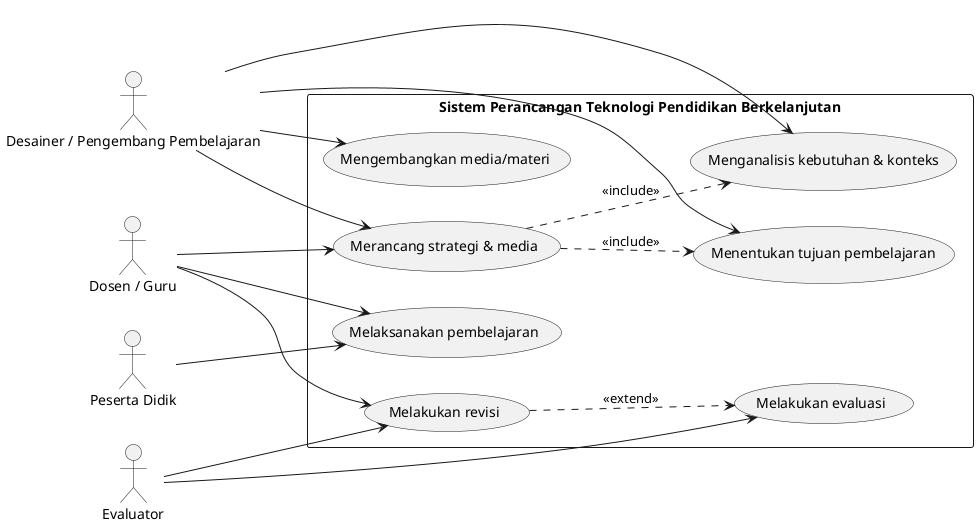
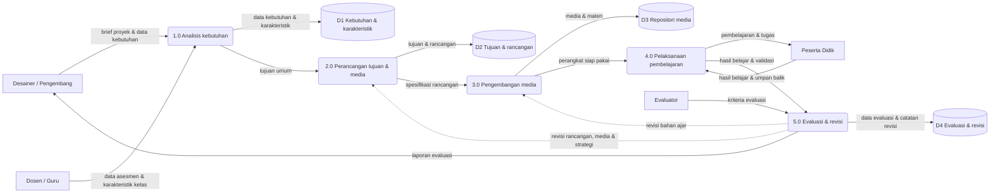

# LAPORAN TUGAS UJIAN TENGAH SEMESTER (UTS)

**Mata Kuliah:** Perancangan Teknologi Pendidikan Berkelanjutan


**Judul:** Analisis dan Perbandingan Model Desain Pembelajaran ADDIE, Dick and Carey, dan Morrison, Ross, and Kemp


**Disusun oleh:** Nur Meysha Putri (NIM 2405176002)


**Program Studi S1 Pendidikan Komputer — Fakultas Keguruan dan Ilmu Pendidikan — Universitas Mulawarman, Samarinda, 2026**


# KATA PENGANTAR

Puji syukur penulis panjatkan kepada Tuhan Yang Maha Esa karena atas rahmat-Nya penulis dapat menyelesaikan laporan tugas Ujian Tengah Semester (UTS) untuk mata kuliah Perancangan Teknologi Pendidikan Berkelanjutan dengan judul “Analisis dan Perbandingan Model Desain Pembelajaran ADDIE, Dick and Carey, dan Morrison, Ross, and Kemp”.

Laporan ini disusun sebagai bentuk kajian teoretis terhadap tiga model desain pembelajaran yang paling banyak dirujuk dalam literatur teknologi pendidikan. Penulis berusaha tidak hanya memaparkan tahapan masing-masing model, tetapi juga membandingkan keduanya dari sisi struktur, kekuatan, keterbatasan, serta kesesuaiannya untuk perancangan pembelajaran yang berkelanjutan. Pembahasan dilengkapi dengan flowchart, use case diagram, dan data flow diagram sebagai bentuk penerjemahan kerangka teoretis ke dalam rancangan sistem yang lebih operasional.

Penulis menyadari bahwa laporan ini masih memiliki keterbatasan, terutama karena kajian dilakukan melalui studi pustaka dan belum melalui uji coba lapangan. Oleh karena itu, kritik dan saran yang membangun sangat penulis harapkan. Semoga laporan ini bermanfaat bagi pembaca, khususnya bagi mahasiswa yang sedang mempelajari perancangan pembelajaran dan pengembangan media pendidikan.

# BAB I PENDAHULUAN

## 1.1 Latar Belakang

Teknologi pendidikan sering dipahami secara sempit sebagai penggunaan alat atau media di dalam kelas, padahal bidang ini memiliki cakupan yang jauh lebih luas. Dalam rumusan yang disusun oleh Association for Educational Communications and Technology (AECT), teknologi pendidikan didefinisikan sebagai studi dan praktik etis dalam memfasilitasi pembelajaran serta meningkatkan kinerja melalui penciptaan, penggunaan, dan pengelolaan proses serta sumber daya teknologi yang tepat (Januszewski & Molenda, 2008). Definisi tersebut menunjukkan bahwa teknologi pendidikan bukan sekadar urusan perangkat keras, melainkan sebuah proses berpikir sistematis tentang bagaimana pembelajaran dirancang, dikembangkan, digunakan, dan dinilai. Di dalam proses berpikir itulah perancangan pembelajaran menempati posisi sentral.

Perancangan pembelajaran atau desain pembelajaran merupakan upaya sistematis untuk menerjemahkan prinsip-prinsip belajar dan hasil analisis kebutuhan menjadi rancangan kegiatan, bahan, dan penilaian yang dapat digunakan secara nyata. Reiser dan Dempsey (2018) menjelaskan bahwa desain pembelajaran mencakup analisis situasi belajar, penentuan tujuan, pengembangan bahan dan strategi, serta evaluasi terhadap hasil dan prosesnya. Dengan kata lain, desain pembelajaran berperan sebagai jembatan antara teori belajar, kebutuhan nyata peserta didik, dan praktik di ruang kelas maupun di ruang digital. Tanpa perancangan yang matang, penggunaan teknologi dalam pembelajaran mudah berhenti pada tahap menarik secara visual tetapi lemah secara pedagogis.

Pentingnya perancangan pembelajaran menjadi semakin terasa ketika pembicaraan diarahkan pada pendidikan berkelanjutan. UNESCO (2020) melalui kerangka Education for Sustainable Development (ESD) for 2030 menekankan bahwa pendidikan harus mampu membangun kompetensi yang memungkinkan peserta didik terus belajar, beradaptasi, dan berkontribusi terhadap perubahan lingkungan dan sosial dalam jangka panjang. Konsekuensinya, pembelajaran tidak dapat dirancang sekali lalu dibiarkan tanpa perbaikan. Rancangan harus bersifat terbuka terhadap evaluasi, revisi, dan pengembangan ulang sehingga tetap relevan ketika kebutuhan peserta didik maupun konteks teknologi berubah. Di sinilah hubungan antara desain pembelajaran dan gagasan pendidikan berkelanjutan menjadi jelas: keduanya menuntut proses yang berulang, bukan produk yang sekali jadi.

Model desain pembelajaran diperlukan karena proses perancangan yang kompleks membutuhkan kerangka kerja yang dapat dipelajari, dikomunikasikan, dan dievaluasi. Tanpa model, perancang pemula cenderung bekerja berdasarkan intuisi sehingga sering melompati tahapan penting, misalnya langsung mengembangkan media tanpa lebih dahulu menganalisis kebutuhan atau merumuskan tujuan. Gustafson dan Branch (2002) menjelaskan bahwa model desain pembelajaran berfungsi sebagai penyederhanaan dari realitas proses pengembangan instruksional yang rumit, sekaligus sebagai alat komunikasi antaranggota tim pengembang. Model juga membantu perancang memprediksi kegiatan apa yang harus dikerjakan, data apa yang perlu dikumpulkan, dan keputusan apa yang harus diambil pada setiap tahap.

Di antara banyak model yang tersedia, ADDIE, Dick and Carey, serta Morrison, Ross, and Kemp merupakan tiga model yang paling sering muncul dalam buku teks maupun penelitian pengembangan. Model ADDIE dikenal karena strukturnya yang sederhana dan mudah diingat (Branch, 2009); model Dick and Carey dikenal karena rinciannya yang sangat sistematis dan menempatkan hubungan antara tujuan, strategi, dan penilaian sebagai inti (Dick et al., 2015); sedangkan model Morrison, Ross, and Kemp dikenal karena sifatnya yang non-linier dan fleksibel dengan sembilan komponen yang saling terkait (Morrison et al., 2019). Ketiganya sering digunakan dalam penelitian pengembangan di Indonesia, mulai dari pengembangan modul, bahan ajar digital, hingga multimedia interaktif (Tegeh & Kirna, 2013; Sewu et al., 2021; Purnama et al., 2025).

Meskipun ketiganya sama-sama berada di bawah payung pendekatan sistem, ketiganya memiliki asumsi dan penekanan yang berbeda. Model ADDIE lebih menonjolkan urutan tahapan yang linier, model Dick and Carey menonjolkan keterpaduan antarkomponen dengan dukungan evaluasi formatif di tengah proses, sedangkan model Morrison, Ross, and Kemp justru menolak urutan yang kaku dan memberi kebebasan kepada perancang untuk memulai dari komponen mana pun. Perbedaan asumsi tersebut membuat pemilihan model tidak dapat dilakukan secara sembarangan. Perancang perlu mengetahui konsekuensi dari setiap pilihan, terutama ketika rancangan harus bertahan dan dikembangkan dalam jangka panjang. Karena alasan itulah laporan ini disusun, yaitu untuk membandingkan ketiga model secara lebih mendalam dan membantu mahasiswa calon pengembang teknologi pendidikan mengambil keputusan perancangan yang sadar serta dapat dipertanggungjawabkan secara akademik.

## 1.2 Rumusan Masalah

1. Apa pengertian dan tahapan model desain pembelajaran ADDIE?
2. Apa pengertian dan tahapan model desain pembelajaran Dick and Carey?
3. Apa pengertian, karakteristik, dan komponen model desain pembelajaran Morrison, Ross, and Kemp?
4. Apa persamaan dan perbedaan di antara ketiga model tersebut?
5. Apa kelebihan dan kekurangan masing-masing model?
6. Model manakah yang paling sesuai untuk perancangan teknologi pendidikan berkelanjutan dan mengapa?

## 1.3 Tujuan Penulisan

1. Mendeskripsikan pengertian dan tahapan model ADDIE beserta contoh penerapannya dalam teknologi pendidikan.
2. Mendeskripsikan pengertian dan tahapan model Dick and Carey beserta contoh penerapannya dalam pengembangan pembelajaran berbasis teknologi.
3. Mendeskripsikan pengertian, karakteristik, dan komponen model Morrison, Ross, and Kemp beserta contoh penerapannya.
4. Menganalisis persamaan dan perbedaan ketiga model berdasarkan aspek-aspek perancangan pembelajaran.
5. Mengidentifikasi kelebihan dan kekurangan masing-masing model berdasarkan literatur akademik.
6. Menganalisis model yang paling sesuai untuk perancangan teknologi pendidikan berkelanjutan beserta alasan yang mendasarinya.

## 1.4 Manfaat Penulisan

Secara teoretis, laporan ini diharapkan dapat memperkaya pemahaman mengenai kerangka kerja perancangan pembelajaran dan kedudukannya dalam bidang teknologi pendidikan. Secara praktis, hasil kajian ini dapat digunakan oleh mahasiswa, guru, dosen, maupun pengembang media sebagai pertimbangan dalam memilih model perancangan yang sesuai dengan konteks pekerjaannya.

Bagi penulis, penyusunan laporan ini menjadi sarana melatih kemampuan membaca literatur akademik dan membandingkan konsep secara kritis. Kemampuan tersebut diperlukan ketika penulis nanti terlibat dalam pengembangan media atau perangkat pembelajaran pada mata pelajaran informatika di sekolah.

Bagi pendidik dan calon pengembang media, hasil kajian ini dapat dijadikan pertimbangan dalam memilih model perancangan yang sesuai dengan jenis pekerjaan. Untuk pengembangan modul ajar sederhana, model yang lebih ringkas mungkin lebih tepat, sedangkan untuk pengembangan sistem pembelajaran daring berskala besar diperlukan model yang lebih rinci dan terkelola.

Bagi pembaca yang ingin meneliti lebih lanjut, uraian pada laporan ini dapat menjadi titik awal untuk membandingkan model lain, misalnya ASSURE, Backward Design, atau model-model yang dikembangkan di Indonesia.

## 1.5 Catatan tentang Penamaan dan Jumlah Model yang Dibandingkan

Sebelum masuk ke pembahasan, perlu diluruskan terlebih dahulu penamaan model yang dibandingkan dalam laporan ini. Instruksi tugas menyebut tiga model, yaitu ADDIE, Dick and Carey, serta Morrison, Ross, and Kemp. Namun, pada sebagian penyebutan muncul empat nama karena tertulis “ADDIE, The Dick, Dick and Carey Model, dan The Morrison, Ross, and Kemp Model”. Setelah ditelusuri pada literatur, “The Dick” dan “Dick and Carey Model” merujuk pada model yang sama, yaitu model desain pembelajaran yang dikembangkan oleh Walter Dick bersama Lou Carey, dan pada edisi-edisi berikutnya juga bersama James O. Carey (Dick, 1996; Dick et al., 2015). Dengan demikian, penulisan empat nama tersebut hampir dapat dipastikan merupakan kekeliruan penyebutan, bukan penunjukan empat model yang berbeda.

Cara yang sama berlaku untuk “Morrison, Ross, and Kemp Model” dan “Kemp Model”. Keduanya merujuk pada kerangka yang sama: model yang pertama kali dikembangkan oleh Jerrold E. Kemp dan kemudian disempurnakan bersama Gary R. Morrison dan Steven M. Ross (Morrison et al., 2019; Purnama et al., 2025). Pada sumber-sumber berbahasa Indonesia, model ini sering hanya disebut “Model Kemp”, sedangkan pada sumber berbahasa Inggris lebih sering disebut “the Morrison, Ross, and Kemp model” atau “the MRK model”. Oleh karena itu, istilah “Kemp”, “Morrison, Ross, and Kemp”, dan “MRK” dalam laporan ini digunakan secara bergantian untuk hal yang sama.

Selain persoalan jumlah model, terdapat juga perbedaan istilah pada penamaan tahapan yang dapat membingungkan pembaca. Pada model ADDIE, tahap pertama lazim ditulis “Analysis”, tetapi Branch (2009) menuliskannya “Analyze” agar konsisten berbentuk kata kerja. Pada model Dick and Carey, jumlah komponen dapat berbeda bergantung edisi buku yang digunakan, misalnya ditambahkannya penilaian kebutuhan (needs assessment) pada edisi revisi (Dick, 1996). Sementara itu, pada model Morrison, Ross, and Kemp, istilah “komponen” dan “tahap” sama-sama dipakai untuk sembilan elemen yang sama. Penjelasan singkat seperti ini penting agar pembaca tidak menyimpulkan adanya model yang berbeda hanya karena perbedaan penyebutan.

Sejalan dengan hal tersebut, laporan ini membandingkan tiga model, yaitu (1) ADDIE, (2) Dick and Carey, dan (3) Morrison, Ross, and Kemp. Tidak ada model yang digabung atau dihilangkan tanpa penjelasan, dan seluruh perbedaan penyebutan telah diuraikan di atas.

# BAB II PEMBAHASAN

## 2.1 Konsep Dasar Model Desain Pembelajaran

Sebelum membandingkan tiga model, perlu disepakati terlebih dahulu apa yang dimaksud dengan desain pembelajaran, apa fungsi model desain pembelajaran, serta di mana posisi keduanya di dalam bidang teknologi pendidikan. Tiga hal tersebut menjadi dasar untuk menilai relevansi setiap model pada pembahasan berikutnya.

### 2.1.1 Pengertian Desain Pembelajaran

Desain pembelajaran dapat dipahami sebagai proses sistematis untuk merancang, mengembangkan, dan mengevaluasi pembelajaran agar tujuan yang telah ditetapkan dapat tercapai secara efektif, efisien, dan menarik. Dick et al. (2015) menyebut proses ini sebagai “sistem” karena setiap komponennya saling berhubungan; perubahan pada satu komponen, misalnya tujuan pembelajaran, akan menuntut penyesuaian pada komponen lain seperti strategi dan instrumen penilaian. Richey et al. (2011) menambahkan bahwa desain pembelajaran mencakup dua sisi sekaligus, yaitu sisi proses (cara perancang bekerja) dan sisi produk (hasil rancangan berupa bahan, media, atau sistem pembelajaran).

Dalam praktiknya, desain pembelajaran biasanya berangkat dari dua pertanyaan pokok: ke mana pembelajaran ini akan diarahkan, dan apa yang dibutuhkan peserta didik untuk sampai ke sana. Dari dua pertanyaan itu diturunkan serangkaian kegiatan analisis, penetapan tujuan, pemilihan strategi, pengembangan bahan, serta penyusunan cara menilai hasil belajar. Karena itu, desain pembelajaran bukan kegiatan administratif yang sekadar melengkapi dokumen kurikulum, melainkan pekerjaan intelektual yang menentukan kualitas pengalaman belajar peserta didik.

### 2.1.2 Model Desain Pembelajaran dan Fungsinya

Model desain pembelajaran adalah representasi sederhana dari proses desain pembelajaran yang sesungguhnya. Gustafson dan Branch (2002) menjelaskan bahwa model dibuat karena proses pengembangan instruksional terlalu kompleks untuk dipahami sekaligus, sehingga perlu disederhanakan menjadi komponen-komponen yang lebih mudah diikuti. Model juga berfungsi sebagai bahasa bersama bagi tim pengembang yang berasal dari latar belakang berbeda, misalnya guru, pengembang media, dan ahli evaluasi, sehingga setiap pihak memahami pekerjaannya masing-masing.

Fungsi lain model desain pembelajaran adalah sebagai alat pengendalian mutu dan alat pengambilan keputusan. Dengannya, perancang dapat memeriksa apakah analisis kebutuhan sudah dilakukan, apakah tujuan sudah dirumuskan secara terukur, dan apakah instrumen penilaian benar-benar mengukur tujuan tersebut. Branch dan Kopcha (2014) mencatat bahwa banyaknya model yang tersedia, mulai dari model linier hingga model non-linier, menunjukkan bahwa tidak ada satu model yang cocok untuk semua situasi. Pemilihan model justru ditentukan oleh konteks pekerjaan, tingkat pengalaman perancang, jumlah tenaga, serta ketersediaan waktu dan sumber daya.

Karena sifatnya yang merupakan penyederhanaan, model tidak dapat dipakai secara mekanis. Model yang paling rinci sekalipun tetap memerlukan pertimbangan profesional dari perancangnya. Bagian inilah yang sering terlewat dalam praktik pengembangan di sekolah, ketika model dipakai hanya sebagai daftar tahapan administratif tanpa pemaknaan.

### 2.1.3 Keterkaitan dengan Teknologi Pendidikan dan Pendidikan Berkelanjutan

Hubungan antara model desain pembelajaran dan teknologi pendidikan terlihat dari kedudukan desain pembelajaran sebagai salah satu kawasan utama bidang teknologi pendidikan. Dalam definisi AECT yang diuraikan Januszewski dan Molenda (2008), teknologi pendidikan mencakup penciptaan (creation), penggunaan (utilization), dan pengelolaan (management) proses serta sumber daya teknologi. Perancangan pembelajaran menempati kawasan penciptaan, karena di dalamnya terjadi proses analisis, desain, pengembangan, implementasi, dan evaluasi yang menghasilkan solusi belajar.

Kaitan tersebut menjadi semakin penting dalam konteks pendidikan berkelanjutan. UNESCO (2020) menegaskan bahwa pendidikan untuk pembangunan berkelanjutan menuntut peserta didik memperoleh kompetensi berpikir kritis, kolaborasi, dan kemampuan bertindak pada situasi nyata. Pembelajaran dengan karakteristik seperti itu tidak dapat dirancang secara sekali jadi. Rancangan perlu bersiklus: diterapkan, dievaluasi, diperbaiki, lalu diterapkan kembali dalam bentuk yang lebih baik. Siklus inilah yang menjadi ciri khas model desain pembelajaran, khususnya pada tahap evaluasi dan revisi, sehingga model desain pembelajaran dapat dipandang sebagai mekanisme menjaga keberlanjutan mutu pembelajaran.

## 2.2 Model ADDIE

### 2.2.1 Pengertian dan Tujuan Penggunaan

ADDIE merupakan singkatan dari lima tahap proses desain pembelajaran, yaitu Analysis (analisis), Design (desain), Development (pengembangan), Implementation (implementasi), dan Evaluation (evaluasi). Branch (2009) menjelaskan ADDIE sebagai kerangka pengorganisasian yang bersifat generik dan sistematis, yang dapat dipakai untuk membangun sumber belajar pada berbagai konteks, baik untuk pembelajaran tatap muka, pembelajaran daring, maupun pelatihan di lingkungan kerja. Disebut generik karena ADDIE tidak mengikat diri pada satu teori belajar tertentu, sehingga dapat dipasangkan dengan pendekatan behavioris, kognitif, maupun konstruktivis.

Tujuan penggunaan model ADDIE adalah memberikan alur kerja yang jelas dan tertata sehingga setiap keputusan perancangan memiliki dasar yang dapat ditelusuri. Ketika suatu produk pembelajaran gagal, ADDIE memungkinkan pengembang menelusuri penyebabnya: apakah masalah muncul karena analisis kebutuhan yang tidak tepat, desain yang tidak selaras, pengembangan bahan yang keliru, implementasi yang tidak terkelola, atau evaluasi yang tidak mengukur hal yang seharusnya. Dengan kata lain, ADDIE berfungsi sebagai alat navigasi sekaligus alat audit proses pengembangan.

Pada praktiknya, ADDIE paling banyak digunakan untuk pengembangan produk pembelajaran, misalnya modul, bahan ajar digital, multimedia interaktif, atau kursus daring. Branch (2009) menegaskan bahwa tiap tahap ADDIE harus diakhiri dengan produk antara (output) yang jelas, misalnya dokumen hasil analisis kebutuhan, rancangan pembelajaran, prototipe bahan ajar, laporan pelaksanaan, dan laporan evaluasi. Adanya produk antara ini memudahkan pengelolaan proyek dan memungkinkan penilaian mutu dilakukan secara bertahap.

### 2.2.2 Sejarah Singkat dan Perdebatan Asal-Usulnya

Sejarah model ADDIE menarik untuk dicatat karena sering menimbulkan salah paham. Molenda (2003) melakukan penelusuran terhadap asal-usul istilah ADDIE dan tidak menemukan satu dokumen tunggal yang secara resmi memperkenalkannya sebagai model. Istilah ADDIE lebih banyak muncul dalam literatur pelatihan dan pengembangan pada akhir 1990-an, sementara kerangka pengembangan instruksional yang mendahuluinya telah dikenal pada 1970-an melalui program pengembangan sistem instruksional di lingkungan militer dan pemerintahan Amerika Serikat. Dengan demikian, ADDIE lebih tepat dipandang sebagai penamaan ulang terhadap proses yang sudah lama dikenal dalam bidang pengembangan instruksional, bukan sebagai penemuan seseorang pada satu titik waktu tertentu. Reiser (2001) mencatat bahwa model-model desain instruksional mulai bermunculan pada 1960-an dan 1970-an, sehingga wajar apabila kerangka kerja yang kemudian dikenal sebagai ADDIE berakar pada periode tersebut.

Implikasi dari temuan Molenda (2003) penting bagi penulis: karena ADDIE bukan milik satu tokoh dan bukan satu dokumen tunggal, rujukan mengenai ADDIE sebaiknya dilakukan pada penyaji yang secara sistematis menguraikannya, misalnya Branch (2009) untuk versi akademiknya, atau pada penelitian pengembangan yang menjelaskan penerapannya secara operasional seperti Tegeh dan Kirna (2013). Hal ini juga menjelaskan mengapa uraian tahapan ADDIE di berbagai sumber sering tampak serupa, meskipun istilah yang dipakai berbeda, misalnya “Analysis” dan “Analyze”.

### 2.2.3 Lima Tahap Model ADDIE

Berikut ini uraian lima tahap ADDIE. Pada setiap tahap dijelaskan pengertiannya, kegiatan yang dilakukan, luaran yang dihasilkan, serta contoh penerapannya dalam konteks teknologi pendidikan.

**a.  Analysis (Analisis)**

Tahap analisis adalah upaya mengumpulkan dan mengolah informasi sebagai dasar seluruh keputusan perancangan. Kegiatan yang dilakukan meliputi analisis kebutuhan belajar (apa kesenjangan antara kondisi nyata dan kondisi yang diharapkan), analisis karakteristik peserta didik (usia, latar belakang, gaya belajar, dan kemampuan awal), analisis tugas (langkah dan keterampilan yang harus dipelajari), analisis konteks (ketersediaan perangkat, jaringan, waktu, dan dukungan sekolah), serta penetapan tujuan umum pembelajaran (Branch, 2009).

Luaran tahap ini biasanya berupa dokumen hasil analisis kebutuhan yang memuat rumusan masalah pembelajaran, profil peserta didik, daftar kompetensi prasyarat, serta tujuan umum yang akan dicapai. Contoh penerapannya dalam teknologi pendidikan adalah ketika seorang guru informatika menemukan bahwa hasil belajar peserta didik pada materi algoritma rendah karena mereka kesulitan membayangkan proses eksekusi perintah. Dari temuan itu, guru menetapkan kebutuhan akan media visual interaktif yang dapat menampilkan langkah eksekusi algoritma secara bertahap.

**b.  Design (Desain)**

Tahap desain adalah kegiatan menyusun rancangan pembelajaran berdasarkan hasil analisis. Kegiatan pada tahap ini mencakup perumusan tujuan pembelajaran khusus yang terukur, pemilihan strategi dan metode pembelajaran, penentuan urutan materi, pemilihan media dan sumber belajar, serta penyusunan kisi-kisi instrumen penilaian. Pada tahap ini pula ditentukan bagaimana pengalaman belajar akan dialami peserta didik, termasuk seberapa besar porsi latihan, umpan balik, dan aktivitas kolaboratif.

Luaran tahap desain berupa dokumen rancangan pembelajaran, misalnya Garis Besar Program Media atau storyboard, rancangan alur pembelajaran, dan kisi-kisi tes. Contoh penerapannya adalah penyusunan storyboard aplikasi latihan soal adaptif, yang di dalamnya ditentukan urutan materi, jenis soal, aturan pemberian umpan balik, serta kriteria ketuntasan. Ketika desain disusun dengan baik, tahap pengembangan menjadi lebih terarah dan biaya revisi dapat ditekan.

**c.  Development (Pengembangan)**

Tahap pengembangan adalah wujud nyata dari rancangan. Kegiatan pada tahap ini meliputi produksi bahan ajar, pengembangan media, pemrograman aplikasi pembelajaran, penyusunan modul atau kursus daring, serta uji coba terbatas untuk memastikan produk berjalan sebagaimana dirancang. Uji coba pada tahap ini umumnya berbentuk validasi ahli (ahli materi dan ahli media) serta uji coba kelompok kecil kepada beberapa peserta didik untuk memperoleh masukan awal.

Luaran tahap pengembangan berupa prototipe atau versi pertama produk pembelajaran beserta catatan revisi dari hasil validasi dan uji coba. Contoh penerapannya dalam teknologi pendidikan adalah pengembangan modul digital matematika yang dilengkapi animasi, latihan interaktif, dan kuis otomatis. Pada tahap ini sering ditemukan bahwa rancangan di atas kertas perlu disesuaikan karena keterbatasan fitur platform atau kendala antarmuka, sehingga revisi kecil menjadi bagian yang wajar dari proses pengembangan.

**d.  Implementation (Implementasi)**

Tahap implementasi adalah pelaksanaan pembelajaran dengan menggunakan produk yang telah dikembangkan. Kegiatan pada tahap ini mencakup penyiapan pengguna, misalnya pelatihan singkat untuk guru atau dosen, pengelolaan kelas atau sistem manajemen pembelajaran, penerapan strategi yang telah dirancang, serta pemantauan jalannya pembelajaran. Branch (2009) menekankan pentingnya kesiapan lingkungan, karena produk pembelajaran yang baik dapat tampak gagal jika jaringan, perangkat, atau kesiapan pengguna tidak memadai.

Luaran tahap implementasi berupa catatan pelaksanaan, rekaman aktivitas peserta didik, serta data awal tentang keterlaksanaan rancangan. Contoh penerapannya adalah pelaksanaan pembelajaran berbasis proyek dengan memanfaatkan platform daring, ketika guru mendampingi peserta didik bekerja dalam kelompok, memantau kemajuan melalui dasbor, dan mencatat kendala teknis yang dialami. Catatan tersebut menjadi bahan berharga bagi tahap evaluasi.

**e.  Evaluation (Evaluasi)**

Tahap evaluasi adalah proses menilai sejauh mana tujuan pembelajaran tercapai dan sejauh mana rancangan pembelajaran bekerja dengan baik. Evaluasi dalam ADDIE berlangsung dalam dua bentuk, yaitu evaluasi formatif yang dilakukan selama proses pengembangan untuk memperbaiki produk, dan evaluasi sumatif yang dilakukan setelah produk digunakan untuk menilai efektivitasnya. Di samping mengukur hasil belajar peserta didik, evaluasi juga menilai kualitas media, kejelasan instruksi, dan keterlaksanaan strategi.

Luaran tahap evaluasi berupa laporan evaluasi yang memuat temuan, analisis data hasil belajar, serta rekomendasi perbaikan. Contoh penerapannya adalah analisis hasil kuis daring yang menunjukkan bahwa sebagian besar peserta didik mengalami kesulitan pada satu topik tertentu; temuan itu kemudian dijadikan dasar untuk merevisi bagian bahan ajar dan menambah latihan pada versi berikutnya. Dengan kata lain, evaluasi pada ADDIE berfungsi sebagai pintu masuk menuju siklus pengembangan selanjutnya, bukan sebagai kegiatan penutup semata.

**Tabel 2.1.** Ringkasan lima tahap model ADDIE

| Tahap | Kegiatan utama | Luaran | Contoh penerapan dalam teknologi pendidikan |
|---|---|---|---|
| Analysis | Analisis kebutuhan, karakteristik peserta didik, tugas, dan konteks; penetapan tujuan umum | Dokumen hasil analisis kebutuhan dan profil peserta didik | Menemukan penyebab rendahnya hasil belajar dan menetapkan kebutuhan media interaktif |
| Design | Perumusan tujuan khusus, pemilihan strategi dan media, penyusunan kisi-kisi penilaian | Rancangan pembelajaran, storyboard, kisi-kisi tes | Menyusun storyboard aplikasi latihan soal adaptif beserta aturan umpan balik |
| Development | Produksi bahan ajar dan media, pemrograman, validasi ahli, uji coba terbatas | Prototipe produk dan catatan revisi | Mengembangkan modul digital dengan animasi, latihan interaktif, dan kuis otomatis |
| Implementation | Pelatihan pengguna, pengelolaan kelas atau LMS, pelaksanaan strategi, pemantauan | Catatan pelaksanaan dan data aktivitas belajar | Melaksanakan pembelajaran berbasis proyek daring dan memantau kemajuan melalui dasbor |
| Evaluation | Evaluasi formatif dan sumatif terhadap proses, produk, dan hasil belajar | Laporan evaluasi dan rekomendasi perbaikan | Menganalisis hasil kuis untuk merevisi bagian bahan ajar yang paling sulit |

### 2.2.4 Diagram Alur Model ADDIE

Alur ADDIE digambarkan sebagai rangkaian lima tahap yang berurutan, dimulai dari analisis dan berakhir pada evaluasi. Meskipun demikian, gambaran tersebut tidak boleh dipahami sebagai proses satu arah yang kaku. Pada kenyataannya, hasil evaluasi dapat mengembalikan proses ke tahap sebelumnya, misalnya kembali ke desain ketika ditemukan bahwa tujuan tidak selaras dengan instrumen penilaian, atau kembali ke pengembangan ketika ditemukan kesalahan teknis pada media. Branch (2009) menekankan bahwa sifat berulang (iteratif) inilah yang membuat ADDIE tetap relevan, karena setiap tahap dapat diperbaiki sebelum produk digunakan secara luas.

Gambar 2.1 berikut memperlihatkan alur lima tahap ADDIE beserta daur revisi yang menghubungkan tahap evaluasi dengan tahap-tahap sebelumnya.

*(Gambar 2.1: flowchart_addie.png — lihat berkas Word)*


## 2.3 Model Dick and Carey

### 2.3.1 Pengertian dan Kedudukan Model

Model Dick and Carey adalah model desain pembelajaran yang dikembangkan oleh Walter Dick, Lou Carey, dan pada edisi-edisi berikutnya bersama James O. Carey melalui buku The Systematic Design of Instruction. Model ini disusun sebagai prosedur yang sistematis untuk merancang, mengembangkan, dan mengevaluasi pembelajaran. Dick et al. (2015) menempatkan model ini sebagai langkah-langkah yang saling terkait, dengan titik berat pada keselarasan antara tujuan pembelajaran, strategi yang dipilih, dan cara penilaian yang digunakan. Karena itu, model ini sering disebut sebagai contoh paling jelas dari penerapan pendekatan sistem pada desain pembelajaran.

Kedudukan model Dick and Carey dalam literatur cukup mapan. Model ini telah digunakan sejak akhir 1970-an, mengalami beberapa kali revisi, dan menjadi rujukan dalam penelitian pengembangan di berbagai negara. Akbulut (2007), misalnya, membandingkan model Dick and Carey dengan model Morrison, Ross, and Kemp khususnya untuk konteks pendidikan jarak jauh. Perbandingan tersebut menyimpulkan bahwa keduanya mengandung komponen ADDIE sebagai kerangka dasar, namun berbeda pada penekanan proseduralnya. Sementara itu di Indonesia, model Dick and Carey sering dipilih dalam penelitian pengembangan karena langkahnya rinci dan mudah dipertanggungjawabkan secara metodologis (Hastutie & Ramli, 2024).

Model ini berorientasi pada pencapaian kompetensi yang dapat diamati dan diukur. Meskipun akar historinya kuat pada tradisi behavioris, Dick (1996) menjelaskan bahwa edisi revisi model ini juga menampung pengaruh teori konstruktivis, terutama pada cara memandang pembelajaran sebagai proses aktif peserta didik dan pada penekanan konteks nyata dalam analisis. Dengan demikian, model Dick and Carey tidak lagi sepenuhnya bersifat behavioris seperti anggapan sebagian orang, tetapi tetap mempertahankan ciri utamanya, yaitu keteraturan dan keselarasan antarkomponen.

### 2.3.2 Tujuan dan Karakteristik Model

Karakteristik pertama model Dick and Carey adalah sifatnya yang berorientasi tujuan (goal oriented). Seluruh kegiatan perancangan berpangkal pada tujuan pembelajaran yang telah dirumuskan; strategi, bahan, dan penilaian dipilih serta dikembangkan untuk memastikan tujuan tersebut tercapai. Konsekuensinya, perancang tidak boleh memulai pengembangan media sebelum tujuan dan kriteria keberhasilan ditetapkan secara jelas (Dick et al., 2015).

Karakteristik kedua adalah keterpaduan antarkomponen. Sepuluh komponen model ini tidak berdiri sendiri, melainkan saling mengunci. Perubahan pada tujuan akan berpengaruh pada instrumen penilaian dan strategi; perubahan pada analisis peserta didik akan berpengaruh pada pemilihan media dan tingkat dukungan yang diperlukan. Jenis keterpaduan seperti ini dikenal sebagai pendekatan sistem, dan merupakan ciri yang paling sering disorot dalam kajian mengenai model Dick and Carey (Richey et al., 2011; Akbulut, 2007).

Karakteristik ketiga adalah keberadaan evaluasi formatif di tengah proses. Evaluasi tidak menunggu produk selesai, tetapi dilakukan pada draf awal melalui uji coba satu-satu, kelompok kecil, dan uji coba lapangan. Hasil evaluasi formatif dipakai untuk merevisi rancangan dan bahan ajar sebelum produk digunakan secara luas. Setelah itu barulah evaluasi sumatif dilakukan untuk menilai efektivitas produk secara keseluruhan (Dick et al., 2015).

Karakteristik keempat adalah tingkat kerincian yang tinggi. Model ini menuntut perancang mengerjakan setiap komponen secara eksplisit, mulai dari menuliskan tujuan performa dengan kata kerja yang dapat diukur hingga menyusun instrumen penilaian yang benar-benar selaras dengan tujuan. Karena kerinciannya itu, model ini sangat membantu perancang pemula agar tidak melompati langkah penting, tetapi juga menuntut waktu dan ketelitian yang lebih besar dibandingkan model yang sederhana.

### 2.3.3 Sepuluh Komponen Model Dick and Carey

Model Dick and Carey terdiri atas sepuluh komponen yang membentuk satu siklus perancangan. Perlu dicatat bahwa penomoran komponen dapat berbeda antar edisi buku. Pada edisi-edisi awal, komponen pertama berisi identifikasi tujuan pembelajaran, sedangkan pada edisi yang lebih baru penilaian kebutuhan (needs assessment) diletakkan di depan untuk menentukan tujuan tersebut, sebagaimana dijelaskan Dick (1996). Yang penting bukanlah urutan penomoran, melainkan hubungan fungsional antarkomponen. Uraian berikut mengikuti susunan yang lazim dipakai pada edisi kedelapan (Dick et al., 2015) beserta contoh penerapannya dalam pembelajaran berbasis teknologi.

**1)  Mengidentifikasi tujuan pembelajaran (assess needs to identify instructional goals)**

Komponen ini berisi kegiatan menetapkan kompetensi yang harus dikuasai peserta didik setelah mengikuti pembelajaran. Penetapan tujuan dilakukan melalui penilaian kebutuhan, yaitu dengan membandingkan kondisi nyata dan kondisi yang diharapkan, serta mempertimbangkan tuntutan kurikulum dan dunia kerja. Hasilnya adalah rumusan tujuan umum yang masih bersifat luas, misalnya “peserta didik mampu menerapkan konsep dasar pemrograman untuk menyelesaikan masalah sederhana”. Dalam konteks teknologi pendidikan, komponen ini menjadi dasar untuk memutuskan apakah persoalan belajar benar-benar memerlukan media digital atau cukup diselesaikan dengan penyesuaian strategi mengajar.

**2)  Melakukan analisis pembelajaran (conduct instructional analysis)**

Analisis pembelajaran adalah kegiatan memetakan keterampilan dan pengetahuan yang harus dikuasai peserta didik untuk mencapai tujuan, termasuk keterampilan prasyarat dan hubungan hierarkis di antaranya. Perancang menyusun peta kompetensi sehingga urutan pembelajaran dapat ditentukan secara logis. Luarannya berupa bagan analisis pembelajaran. Contohnya, untuk tujuan penerapan konsep pemrograman, peta kompetensi memuat prasyarat berupa pemahaman variabel, struktur percabangan, dan perulangan; dari peta itu diketahui bahwa media latihan sebaiknya difokuskan pada materi yang paling banyak menjadi penghambat, bukan pada seluruh materi secara merata.

**3)  Menganalisis peserta didik dan konteks (analyze learners and contexts)**

Komponen ini menelaah karakteristik peserta didik, seperti kemampuan awal, minat, gaya belajar, usia, dan kebutuhan khusus, serta konteks tempat pembelajaran berlangsung dan konteks tempat kompetensi akan digunakan. Luarannya berupa profil peserta didik dan catatan konteks belajar. Dalam pengembangan pembelajaran berbasis teknologi, analisis ini menentukan keputusan teknis, misalnya apakah aplikasi perlu dirancang agar tetap dapat diakses tanpa koneksi internet, apakah antarmuka perlu dibuat sederhana untuk pengguna ponsel, dan seberapa besar kebutuhan pendampingan guru.

**4)  Merumuskan tujuan performa (write performance objectives)**

Tujuan performa adalah penjabaran tujuan umum menjadi rumusan yang lebih khusus dan terukur, umumnya memuat unsur perilaku yang diharapkan, kondisi pencapaian, dan kriteria keberhasilan. Luaran komponen ini berupa daftar tujuan pembelajaran khusus yang menjadi acuan pengembangan bahan dan penilaian. Contoh rumusan adalah “diberikan sebuah kasus sederhana, peserta didik mampu menuliskan algoritma penyelesaian dalam bentuk pseudokode dengan tepat pada minimal tiga dari empat kasus yang diberikan”.

**5)  Mengembangkan instrumen penilaian (develop assessment instruments)**

Pada komponen ini perancang menyusun tes atau instrumen penilaian yang benar-benar mengukur tujuan performa yang telah dirumuskan. Instrumen dapat berbentuk tes pilihan ganda, tugas unjuk kerja, rubrik penilaian proyek, atau kombinasi ketiganya. Luarannya berupa kisi-kisi dan butir instrumen beserta rubrik. Contoh penerapannya adalah penyusunan rubrik penilaian proyek pembuatan aplikasi sederhana, lengkap dengan kriteria fungsionalitas, kerapian kode, dan kemampuan menjelaskan hasil karya.

**6)  Mengembangkan strategi pembelajaran (develop instructional strategy)**

Strategi pembelajaran mencakup pilihan pendekatan, metode, urutan penyajian, bentuk latihan, dan umpan balik yang akan diberikan. Pada komponen ini pula ditentukan bagaimana motivasi peserta didik dibangkitkan dan bagaimana materi disajikan secara bertahap. Luarannya berupa rancangan strategi pembelajaran yang siap diterjemahkan menjadi bahan. Contoh penerapannya adalah kombinasi pembelajaran berbasis masalah dengan pendekatan flipped classroom, ketika peserta didik mempelajari materi dasar melalui video sebelum kelas, lalu menggunakan waktu tatap muka untuk diskusi dan praktik terbimbing.

**7)  Mengembangkan dan memilih bahan ajar (develop and select instructional materials)**

Komponen ini adalah kegiatan memproduksi bahan ajar baru atau memilih bahan yang sudah tersedia sesuai rancangan. Produksi dapat mencakup modul, video, animasi, soal latihan, maupun konten digital interaktif. Luarannya berupa draf bahan ajar dan media. Contoh penerapannya adalah pembuatan video pembelajaran pendek yang disertai pertanyaan pemandu, serta penyusunan lembar kerja digital yang dapat diisi langsung oleh peserta didik.

**8)  Merancang dan melaksanakan evaluasi formatif (design and conduct formative evaluation)**

Evaluasi formatif dilakukan untuk menguji draf produk sebelum digunakan secara luas. Uji coba umumnya dilakukan dalam tiga tahap, yaitu uji satu-satu untuk menemukan kesalahan besar, uji kelompok kecil untuk melihat keterlaksanaan, dan uji lapangan untuk menguji keefektifan pada kondisi nyata (Dick et al., 2015). Luarannya berupa catatan temuan beserta usulan perbaikan. Contoh penerapannya adalah meminta dua orang peserta didik mencoba aplikasi latihan, mencatat bagian yang membingungkan, lalu memperbaiki tata letak serta kalimat instruksi pada aplikasi.

**9)  Melakukan revisi pembelajaran (revise instruction)**

Revisi adalah komponen yang menghubungkan temuan evaluasi dengan perbaikan rancangan. Revisi dapat menyentuh tujuan, instrumen penilaian, strategi, maupun bahan ajar, bergantung pada akar masalah yang ditemukan. Komponen ini menegaskan bahwa desain pembelajaran adalah proses berulang, bukan sekali jadi. Dalam praktik pengembangan media, revisi biasanya tercatat dalam lembar catatan revisi agar perubahan dapat ditelusuri dan dipertanggungjawabkan.

**10)  Merancang dan melaksanakan evaluasi sumatif (design and conduct summative evaluation)**

Evaluasi sumatif dilakukan setelah produk digunakan untuk menilai tingkat keberhasilan secara keseluruhan. Evaluasi ini dapat berupa perbandingan hasil belajar antara kelompok pengguna dan kelompok pembanding, analisis kepuasan pengguna, atau penilaian ahli terhadap kelayakan produk. Luarannya berupa laporan evaluasi sumatif yang memuat simpulan tentang efektivitas, efisiensi, dan daya tarik produk. Contoh penerapannya adalah membandingkan hasil tes akhir antara kelas yang menggunakan media digital dan kelas yang tidak menggunakannya, kemudian melaporkan perbedaannya sebagai dasar keputusan apakah media tersebut layak digunakan secara luas.

**Tabel 2.2.** Ringkasan komponen model Dick and Carey

| Komponen | Maksud dan kegiatan utama | Luaran | Contoh penerapan |
|---|---|---|---|
| 1. Identifikasi tujuan | Penilaian kebutuhan dan penetapan kompetensi yang harus dikuasai | Rumusan tujuan umum pembelajaran | Menetapkan tujuan pembelajaran informatika berdasarkan hasil asesmen awal |
| 2. Analisis pembelajaran | Memetakan keterampilan dan pengetahuan prasyarat | Bagan analisis pembelajaran | Menyusun peta prasyarat materi pemrograman sebelum media dikembangkan |
| 3. Analisis peserta didik dan konteks | Menelaah karakteristik peserta didik serta konteks belajar dan penggunaan | Profil peserta didik dan catatan konteks | Memutuskan aplikasi dirancang agar dapat dipakai tanpa koneksi internet |
| 4. Tujuan performa | Menjabarkan tujuan menjadi rumusan khusus yang terukur | Daftar tujuan pembelajaran khusus | Menuliskan tujuan dengan kriteria keberhasilan yang jelas untuk tiap materi |
| 5. Instrumen penilaian | Menyusun tes dan rubrik yang selaras dengan tujuan | Kisi-kisi, butir tes, dan rubrik | Menyusun rubrik penilaian proyek pembuatan aplikasi sederhana |
| 6. Strategi pembelajaran | Merancang pendekatan, metode, urutan, latihan, dan umpan balik | Rancangan strategi pembelajaran | Mengombinasikan flipped classroom dengan pembelajaran berbasis masalah |
| 7. Bahan ajar | Memproduksi atau memilih bahan dan media sesuai rancangan | Draf bahan ajar dan media | Membuat video pendek dan lembar kerja digital berisi pertanyaan pemandu |
| 8. Evaluasi formatif | Menguji draf melalui uji satu-satu, kelompok kecil, dan uji lapangan | Catatan temuan dan usulan perbaikan | Meminta peserta didik mencoba aplikasi lalu memperbaiki instruksi yang membingungkan |
| 9. Revisi | Memperbaiki rancangan dan bahan berdasarkan temuan evaluasi | Catatan revisi dan produk perbaikan | Menyederhanakan alur latihan agar tidak melelahkan pengguna |
| 10. Evaluasi sumatif | Menilai efektivitas, efisiensi, dan daya tarik produk secara keseluruhan | Laporan evaluasi sumatif | Membandingkan hasil belajar kelas pengguna media dan kelas pembanding |

### 2.3.4 Flowchart Model Dick and Carey

Secara ringkas, alur model Dick and Carey dapat digambarkan sebagai berikut. Komponen 2 dan 3, 4 dan 5, serta 6 dan 7 dapat dikerjakan secara paralel, sedangkan hasil komponen 8 mengalir ke komponen 9 untuk merevisi komponen 4, 6, dan 7. Komponen 10 berada di luar siklus utama karena dilaksanakan setelah produk selesai dan digunakan. Gambar 2.2 menampilkan alur tersebut secara lengkap.

*(Gambar 2.2: flowchart_dick_carey.png — lihat berkas Word)*


## 2.4 Model Morrison, Ross, and Kemp

### 2.4.1 Pengertian dan Perkembangan Model Kemp

Model Morrison, Ross, and Kemp berawal dari kerangka desain pembelajaran yang dikembangkan Jerrold E. Kemp pada 1970-an dan kemudian disempurnakan bersama Gary R. Morrison dan Steven M. Ross melalui buku Designing Effective Instruction. Edisi kedelapan buku tersebut diterbitkan pada 2019 dengan tambahan penulis Jennifer R. Morrison dan Howard K. Kalman (Morrison et al., 2019). Karena itu, model ini dikenal dengan beberapa sebutan sekaligus, yaitu Model Kemp, model Morrison-Ross-Kemp (MRK), atau model Kemp-Morrison-Ross. Penamaan Morrison, Ross, and Kemp mulai lazim dipakai setelah terbitnya buku Designing Effective Instruction pada 1994 yang ditulis Kemp bersama Morrison dan Ross (Kemp et al., 1994; Purnama et al., 2025).

Perlu diluruskan satu hal yang sering muncul pada sumber tidak resmi, yaitu anggapan bahwa KEMP merupakan akronim dari Knowledge, Experience, Meaning, and Plan. Anggapan tersebut tidak memiliki dasar pada karya Kemp maupun Morrison dan Ross. Kemp dalam nama model ini adalah nama keluarga Jerrold E. Kemp sebagai pengembang kerangka awalnya. Penulis memandang penting untuk mencatat hal ini agar pembaca tidak mengambil kesimpulan yang keliru mengenai asal-usul model.

Secara konseptual, model ini berpijak pada keyakinan bahwa pembelajaran melibatkan banyak faktor yang saling memengaruhi. Morrison et al. (2019) menempatkan empat komponen dasar sebagai inti perancangan, yaitu peserta didik, tujuan, metode, dan evaluasi. Keempatnya kemudian dijabarkan ke dalam sembilan komponen yang lebih terperinci. Karena sifatnya yang holistik, model ini sering dipakai untuk merancang program pembelajaran yang menuntut pertimbangan menyeluruh terhadap konteks, bukan sekadar penyusunan bahan ajar.

### 2.4.2 Karakteristik Utama

Karakteristik utama model ini adalah sifatnya yang non-linier. Sembilan komponennya tidak disusun sebagai rangkaian bertahap yang harus dilalui dalam satu urutan tetap, melainkan sebagai elemen yang saling terkait dalam bentuk oval. Perancang diperbolehkan memulai pekerjaan dari komponen yang paling mendesak informasinya, misalnya dari analisis kebutuhan, dari karakteristik peserta didik, atau bahkan dari rumusan tujuan yang sudah tersedia (Morrison et al., 2019; Bajracharya, 2019). Konsekuensinya, model ini menuntut pertimbangan profesional yang lebih besar, karena perancang sendiri yang menentukan titik masuk dan urutan pekerjaan.

Karakteristik kedua tampak pada struktur visualnya yang berbentuk tiga lapis. Lapisan paling dalam berisi sembilan komponen inti, lapisan berikutnya menggambarkan kegiatan revisi dan evaluasi formatif yang dapat dilakukan pada setiap tahap, sedangkan lapisan terluar memuat perencanaan proyek, manajemen proyek, serta layanan pendukung. Lapisan terluar ini penting karena mengingatkan bahwa pengembangan pembelajaran selalu berlangsung dalam batas waktu, anggaran, dan dukungan kelembagaan tertentu (Morrison et al., 2019; Purnama et al., 2025).

Karakteristik ketiga adalah sudut pandang yang berpusat pada peserta didik. Analisis karakteristik peserta didik ditempatkan sebagai komponen yang wajib diperhatikan, bahkan sebelum konten dan strategi dirancang. Morrison et al. (2019) menegaskan bahwa keputusan tentang materi, media, dan penilaian seharusnya berpangkal pada kebutuhan dan prioritas peserta didik, bukan pada kemudahan pengajar. Pandangan ini membuat model MRK dinilai lebih humanistis, terutama jika dibandingkan dengan model yang sangat prosedural.

Karakteristik keempat adalah adanya enam pertanyaan pemandu yang diajukan pada awal perancangan, meliputi tingkat kesiapan peserta didik, strategi dan media yang paling sesuai, tingkat dukungan belajar yang dibutuhkan, cara mengukur ketercapaian, serta rancangan evaluasi formatif dan sumatif. Pertanyaan-pertanyaan tersebut berfungsi sebagai alat orientasi awal sebelum perancang memutuskan komponen mana yang dikerjakan lebih dahulu (Morrison et al., 2019). Dengan cara ini, keluwesan model tetap disertai rambu-rambu agar proses tidak berjalan tanpa arah.

### 2.4.3 Sembilan Komponen Model Morrison, Ross, and Kemp

Sembilan komponen model MRK diuraikan berikut ini. Urutan penomorannya hanya menunjukkan pola logis yang biasa dipakai dalam praktik, bukan urutan yang wajib diikuti.

**1)  Mengidentifikasi masalah pembelajaran dan menetapkan tujuan program**

Komponen ini memuat kegiatan mengenali kesenjangan antara kemampuan yang dimiliki peserta didik dan kemampuan yang diharapkan, serta menetapkan tujuan pengembangan program pembelajaran. Identifikasi masalah dapat dilakukan melalui analisis kebutuhan, analisis tujuan, atau penilaian kinerja (Morrison et al., 2019). Contoh penerapannya adalah menemukan bahwa peserta didik mampu menghafal istilah dasar jaringan komputer tetapi tidak dapat menerapkannya ketika melakukan konfigurasi sederhana; temuan itu menjadi dasar tujuan pengembangan media simulasi konfigurasi jaringan.

**2)  Menelaah karakteristik peserta didik**

Pada komponen ini perancang mempelajari ciri peserta didik yang relevan bagi keputusan perancangan, misalnya kemampuan awal, gaya belajar, motivasi, latar belakang sosial budaya, dan kondisi perangkat digital yang digunakan. Contoh penerapannya adalah merancang aplikasi pembelajaran yang menampilkan materi dalam potongan pendek agar dapat dipelajari pada ponsel dengan durasi belajar yang tidak tetap, karena sebagian besar peserta didik mengakses materi pada waktu perjalanan.

**3)  Menganalisis tugas dan menetapkan isi materi**

Analisis tugas adalah kegiatan menguraikan kompetensi kompleks menjadi bagian-bagian yang lebih kecil, sedangkan penetapan isi materi memastikan bahwa materi yang dipilih memang mendukung pencapaian tujuan. Contoh penerapannya adalah memecah kompetensi “membuat basis data sederhana” menjadi merancang tabel, menentukan relasi, menuliskan perintah dasar, dan menguji hasil; bagian-bagian itulah yang kemudian dijadikan kerangka modul digital.

**4)  Merumuskan tujuan pembelajaran**

Rumusan tujuan pembelajaran dituliskan secara jelas agar dapat dijadikan dasar penilaian dan penyusunan strategi. Kemp menempatkan tujuan sebagai salah satu dari empat komponen inti, namun tetap menekankan bahwa tujuan perlu ditinjau ulang ketika informasi dari komponen lain menunjukkan kebutuhan baru (Bajracharya, 2019). Contoh penerapannya adalah menuliskan tujuan yang menekankan kemampuan menerapkan, bukan hanya menyebutkan, misalnya “peserta didik mampu menentukan struktur tabel yang tepat untuk menyelesaikan kasus penyimpanan data tertentu”.

**5)  Menentukan urutan isi materi**

Komponen ini mengatur urutan penyajian materi agar sesuai dengan kesiapan peserta didik, mulai dari yang mudah menuju yang kompleks, atau dari pengalaman konkret menuju konsep abstrak. Contoh penerapannya adalah menyusun urutan modul pemrograman dimulai dari perintah sederhana, dilanjutkan percabangan, perulangan, dan berakhir pada penyusunan fungsi, serta memastikan tiap modul memiliki latihan sebelum materi berikutnya.

**6)  Mengembangkan strategi pembelajaran**

Strategi pembelajaran dirancang agar setiap peserta didik memiliki kesempatan menguasai tujuan. Kegiatan pada komponen ini mencakup persiapan belajar, pemberian motivasi, penyesuaian terhadap perbedaan individual, dan pengaturan kondisi pembelajaran (Morrison et al., 2019). Contoh penerapannya adalah penerapan pembelajaran berdiferensiasi berbantuan teknologi, ketika peserta didik dengan kemampuan awal berbeda memperoleh jalur latihan yang tingkat kesulitannya disesuaikan secara otomatis oleh aplikasi.

**7)  Merancang pesan pembelajaran dan cara penyampaiannya**

Pada komponen ini perancang memilih bentuk pesan, media, dan moda penyampaian yang paling sesuai dengan isi dan karakteristik peserta didik. Contoh penerapannya adalah memilih video singkat berisi animasi proses untuk materi yang bersifat prosedural dan diagram interaktif untuk materi yang bersifat konseptual, serta menentukan bahwa seluruh materi dapat diakses melalui sistem manajemen pembelajaran sekolah.

**8)  Mengembangkan instrumen evaluasi**

Komponen ini memuat penyusunan alat penilaian yang dapat mengukur ketercapaian tujuan, mencakup penilaian formatif untuk memantau proses dan penilaian sumatif untuk menilai hasil. Contoh penerapannya adalah memanfaatkan kuis daring dengan umpan balik otomatis sebagai penilaian formatif, dan menempatkan proyek akhir sebagai penilaian sumatif yang menuntut penerapan pengetahuan pada situasi nyata.

**9)  Memilih dan menyediakan sumber serta layanan pendukung**

Komponen terakhir menekankan bahwa pembelajaran membutuhkan sumber daya dan dukungan, misalnya ketersediaan laboratorium, akses internet, pendampingan teknis, atau pelatihan bagi guru. Morrison et al. (2019) menyebut komponen ini sebagai bagian yang menutup siklus, karena keterbatasan sumber daya akan mengubah keputusan pada komponen-komponen sebelumnya. Contoh penerapannya adalah menjadwalkan pelatihan singkat bagi guru sebelum media digital diterapkan, serta menyiapkan modul cadangan berbasis cetak untuk digunakan ketika jaringan bermasalah.

**Tabel 2.3.** Ringkasan sembilan komponen model Morrison, Ross, and Kemp

| Komponen | Maksud | Contoh penerapan dalam teknologi pendidikan |
|---|---|---|
| 1. Masalah dan tujuan program | Mengenali kesenjangan kemampuan dan menetapkan tujuan pengembangan | Menemukan bahwa peserta didik belum mampu menerapkan konsep jaringan, lalu menetapkan tujuan media simulasi |
| 2. Karakteristik peserta didik | Menelaah ciri peserta didik yang berpengaruh pada keputusan rancangan | Merancang materi berdurasi pendek karena banyak peserta didik mengakses melalui ponsel |
| 3. Analisis tugas dan isi | Menguraikan kompetensi menjadi bagian kecil dan menetapkan materi | Memecah kompetensi basis data menjadi perancangan tabel, relasi, perintah, dan pengujian |
| 4. Tujuan pembelajaran | Merumuskan tujuan secara jelas sebagai dasar penilaian dan strategi | Menuliskan tujuan yang menekankan kemampuan menerapkan pada kasus nyata |
| 5. Urutan isi | Mengatur urutan materi sesuai kesiapan peserta didik | Menyusun urutan modul pemrograman dari perintah sederhana hingga fungsi |
| 6. Strategi pembelajaran | Merancang cara agar setiap peserta didik dapat menguasai tujuan | Menerapkan latihan berjenjang otomatis untuk mengakomodasi kemampuan awal yang berbeda |
| 7. Desain pesan dan penyampaian | Memilih bentuk pesan, media, dan moda penyampaian | Memilih animasi prosedural untuk materi proses dan diagram interaktif untuk materi konsep |
| 8. Instrumen evaluasi | Menyusun alat ukur ketercapaian tujuan secara formatif dan sumatif | Kuis daring berumpan balik otomatis dan proyek akhir sebagai penilaian sumatif |
| 9. Sumber dan layanan pendukung | Menyediakan sumber daya serta dukungan teknis dan pelatihan | Pelatihan singkat guru dan penyediaan modul cetak cadangan bila jaringan bermasalah |

### 2.4.4 Representasi Visual Model

Representasi visual model MRK berbentuk oval yang terdiri atas tiga lapis. Lapisan terdalam berisi sembilan komponen inti yang saling terkait; lapisan tengah menggambarkan kegiatan revisi dan evaluasi formatif yang dapat dilakukan pada setiap tahap; sedangkan lapisan terluar memuat perencanaan proyek, manajemen proyek, dan layanan pendukung. Tidak adanya garis berarah tegas antarkomponen menunjukkan bahwa model ini tidak menetapkan urutan wajib (Morrison et al., 2019).

Untuk memudahkan pembacaan, Gambar 2.3 menampilkan sembilan komponen tersebut beserta ketiga lapisnya, sementara Gambar 2.4 menampilkan alur tiga fase yang biasa dipakai ketika model ini diterapkan secara berurutan, yaitu fase desain, fase pengembangan, dan fase evaluasi.

*(Gambar 2.3 dan Gambar 2.4: flowchart_kemp.png dan flowchart_morrison_ross.png)*


## 2.5 Persamaan Ketiga Model

Hal pertama yang perlu dikemukakan adalah bahwa ketiga model sama-sama merupakan model desain pembelajaran, bukan sekadar kumpulan tips mengajar. Ketiganya berangkat dari asumsi bahwa pembelajaran dapat dirancang secara sengaja dan bahwa mutu hasil belajar dipengaruhi oleh mutu keputusan yang diambil sebelum pembelajaran berlangsung. Ketiganya juga menolak pandangan bahwa mengajar cukup dilakukan berdasarkan kebiasaan. Perbedaan di antara mereka terutama terletak pada cara mengatur urutan kerja, bukan pada ada atau tidaknya komponen analisis, pengembangan, dan evaluasi (Gustafson & Branch, 2002; Akbulut, 2007).

Persamaan kedua tampak pada perhatian terhadap kebutuhan peserta didik. Model ADDIE menempatkan analisis kebutuhan dan karakteristik peserta didik pada tahap pertama (Branch, 2009). Model Dick and Carey menempatkan analisis peserta didik dan konteks sebagai komponen ketiga yang berjalan sejajar dengan analisis pembelajaran (Dick et al., 2015). Model Morrison, Ross, and Kemp bahkan menempatkan peserta didik sebagai salah satu dari empat komponen inti perancangan (Morrison et al., 2019). Kesamaan ini menunjukkan bahwa ketiga model memandang pembelajaran sebagai kegiatan yang ditujukan untuk manusia tertentu dengan kebutuhan tertentu, bukan untuk peserta didik yang seragam.

Persamaan ketiga adalah keberadaan tujuan pembelajaran sebagai rujukan utama. Pada model ADDIE, tujuan dirumuskan pada akhir tahap analisis dan disempurnakan pada tahap desain. Pada model Dick and Carey, tujuan menjadi komponen pertama yang kemudian dijabarkan menjadi tujuan performa yang terukur. Pada model Morrison, Ross, and Kemp, tujuan termasuk salah satu komponen dasar yang wajib ada. Ketiganya sepakat bahwa tanpa rumusan tujuan yang jelas, pemilihan strategi dan penilaian akan kehilangan arah, serta sulit dipertanggungjawabkan.

Persamaan keempat berkaitan dengan pengembangan materi dan strategi pembelajaran. Ketiga model menghendaki adanya keputusan sadar mengenai bagaimana materi diurutkan, metode apa yang dipakai, media apa yang dipilih, dan bagaimana umpan balik diberikan. Model ADDIE meletakkan hal itu pada tahap desain dan pengembangan, model Dick and Carey pada komponen keenam dan ketujuh, sedangkan model Morrison, Ross, and Kemp pada komponen kelima sampai ketujuh. Dengan kata lain, ketiganya mengakui bahwa materi dan strategi bukan hal yang dapat diabaikan atau diserahkan begitu saja kepada kebiasaan.

Persamaan kelima terletak pada posisi evaluasi dan revisi. Ketiga model memandang evaluasi sebagai bagian dari proses perancangan, bukan kegiatan tambahan di akhir. Meskipun cara penempatannya berbeda, ketiganya menerima gagasan bahwa temuan evaluasi harus mengubah rancangan. Pada model ADDIE hal ini dinyatakan melalui daur revisi; pada model Dick and Carey melalui komponen revisi yang secara eksplisit menghubungkan evaluasi formatif dengan komponen perancangan; pada model Morrison, Ross, and Kemp melalui lapisan revisi dan evaluasi formatif yang mengelilingi seluruh komponen (Molenda, 2003; Dick et al., 2015; Morrison et al., 2019).

Persamaan keenam adalah orientasi pada hasil akhir yang sama, yaitu pembelajaran yang efektif, efisien, dan menarik. Ketiganya berupaya memastikan bahwa tujuan tercapai, waktu dan biaya tidak terbuang, serta peserta didik tetap termotivasi untuk belajar. Karena tujuan akhirnya sama, perbedaan model sebaiknya dibaca sebagai perbedaan cara kerja yang masing-masing memiliki keunggulan pada situasi tertentu, bukan sebagai pertentangan yang harus dimenangkan salah satu pihak.

Persamaan terakhir yang penulis catat adalah kedudukan ketiganya sebagai kerangka umum yang perlu diterjemahkan ke dalam praktik. Ketiga model tidak menyediakan resep siap pakai mengenai isi materi atau bentuk media. Ketiganya hanya menyediakan struktur kerja; keputusan mengenai substansi tetap berada pada perancang. Hal ini sejalan dengan pandangan bahwa model adalah alat bantu berpikir, bukan pengganti pertimbangan profesional (Branch & Kopcha, 2014).

## 2.6 Kelebihan dan Kekurangan Masing-Masing Model

Kelebihan dan kekurangan ketiga model tidak dapat dinilai secara umum tanpa memperhatikan konteks penggunaannya. Model yang sangat rinci dapat menjadi kelebihan ketika pengembangnya bekerja dalam tim besar dengan kebutuhan dokumentasi yang ketat, tetapi menjadi kekurangan ketika perancangnya bekerja sendiri dengan waktu terbatas. Dengan catatan tersebut, Tabel 2.4 merangkum kelebihan dan kekurangan ketiga model, yang kemudian dijelaskan pada paragraf-paragraf berikutnya.

**Tabel 2.4.** Perbandingan kelebihan dan kekurangan tiga model

| Model | Kelebihan | Kekurangan |
|---|---|---|
| ADDIE | 1) Struktur sederhana dan mudah diingat; 2) bersifat generik sehingga dapat dipakai pada berbagai konteks dan teori belajar; 3) mudah dikomunikasikan kepada pemangku kepentingan; 4) setiap tahap menghasilkan luaran yang jelas sehingga mudah dipantau; 5) banyak rujukan dan contoh penerapannya. | 1) Kesan linier yang kuat membuat pengguna pemula cenderung memperlakukan tahapan sebagai urutan kaku; 2) cenderung berorientasi pada produk sehingga kurang menekankan dinamika kelas; 3) tahap analisis sering dianggap mahal dan menyita waktu; 4) tidak dirancang khusus untuk proyek besar yang membutuhkan manajemen serta layanan pendukung; 5) rujukan asal-usulnya tidak tunggal sehingga dapat menimbulkan kerancuan akademik. |
| Dick and Carey | 1) Sangat sistematis dan rinci; 2) menekankan keselarasan tujuan, strategi, dan penilaian; 3) evaluasi formatif berada di tengah proses sehingga kesalahan dapat ditemukan lebih awal; 4) cocok untuk pengembangan produk dan sistem berskala besar; 5) banyak dijadikan rujukan penelitian pengembangan sehingga mudah dipertanggungjawabkan. | 1) Membutuhkan waktu dan tenaga besar karena setiap komponen harus dikerjakan secara eksplisit; 2) tampak rumit bagi perancang pemula; 3) kurang luwes jika diterapkan pada pembelajaran yang sangat situasional dan cepat berubah; 4) risiko berhenti di tengah jalan lebih besar apabila tidak ada dukungan tim; 5) struktur bertahapnya membuat revisi besar sering menuntut pengulangan pekerjaan dari komponen awal. |
| Morrison, Ross, and Kemp | 1) Non-linier sehingga luwes dan dapat dimulai dari komponen mana pun; 2) berpusat pada peserta didik; 3) memperhitungkan manajemen proyek serta layanan pendukung; 4) menempatkan revisi dan evaluasi formatif sebagai kegiatan yang berlangsung sepanjang proses; 5) cocok untuk pembelajaran berdiferensiasi dan konteks yang berubah cepat. | 1) Keluwesan menuntut pengalaman dan pertimbangan profesional yang tinggi sehingga sulit bagi perancang pemula; 2) tidak ada urutan baku sehingga dapat menimbulkan kebingungan dan inkonsistensi bila tidak dikelola dengan disiplin; 3) cenderung berasumsi pada pembelajaran klasik atau terbimbing karena peran pengajar sangat besar; 4) dukungan administratif dan kelembagaan menjadi prasyarat sehingga sulit diterapkan pada lingkungan dengan sumber daya terbatas; 5) dokumentasi proses menjadi tanggung jawab perancang sendiri. |

Pada model ADDIE, keunggulan utamanya terletak pada kesederhanaan dan sifat generiknya. Karena hanya terdiri atas lima tahap, ADDIE mudah dipahami bahkan oleh orang yang baru pertama kali mempelajari desain pembelajaran. Sifat generik tersebut membuat ADDIE dapat digunakan untuk mengembangkan modul cetak, multimedia interaktif, maupun kursus daring tanpa harus mengubah kerangka dasarnya (Branch, 2009). Namun, kesederhanaan itu juga menyimpan risiko. Gambaran linier pada ADDIE sering ditafsirkan sebagai urutan yang tidak boleh dilanggar, padahal evaluasi dan revisi dapat mengembalikan proses ke tahap sebelumnya (Tegeh & Kirna, 2013). Kekurangan lain adalah kecenderungan berorientasi pada produk; aspek dinamika kelas, motivasi yang muncul selama pembelajaran, dan interaksi sosial peserta didik kurang menjadi perhatian utama.

Model Dick and Carey unggul pada kedisiplinan berpikir. Karena setiap komponen harus dikerjakan secara eksplisit, kesalahan yang biasanya tersembunyi, misalnya ketidakselarasan antara tujuan dan soal tes, lebih cepat terdeteksi. Penempatan evaluasi formatif di tengah proses memungkinkan perbaikan dilakukan sebelum produk digunakan secara luas, sehingga risiko kegagalan pada tahap implementasi dapat ditekan (Dick et al., 2015). Kekurangan model ini adalah biaya prosesnya. Kerincian tersebut menuntut waktu, tenaga, dan sering kali tambahan tenaga ahli. Untuk pembelajaran yang bersifat cepat berubah atau kontekstual, misalnya pembelajaran berbasis proyek tematik yang berlangsung singkat, penerapan penuh model ini dapat terasa berlebihan. Model ini juga lebih mudah dijalankan jika tersedia tim, baik untuk mengembangkan media maupun untuk melakukan uji coba.

Keunggulan model Morrison, Ross, and Kemp terletak pada keluwesan dan kesadaran kontekstualnya. Perancang dapat memulai dari komponen yang paling mendesak, sehingga model ini lebih ramah terhadap situasi saat data awal belum lengkap tetapi waktu pengembangan terbatas (Purnama et al., 2025). Kehadiran lapisan manajemen proyek dan layanan pendukung merupakan nilai tambah karena mengingatkan bahwa pengembangan pembelajaran selalu berlangsung di dalam batas sumber daya tertentu. Sebaliknya, keluwesan itu menjadi kekurangan bagi perancang pemula. Tanpa urutan yang jelas, pekerjaan mudah melompat-lompat dan tidak terdokumentasi dengan baik. Kritik lain yang muncul dalam literatur adalah bahwa model ini masih condong pada pola pembelajaran klasikal atau terbimbing, sehingga peran pengajar tetap besar dan kebutuhan akan dukungan administratif menjadi tinggi (Bajracharya, 2019; Hastutie & Ramli, 2024).

## 2.7 Perbandingan Ketiga Model

Untuk mempertajam perbandingan, Tabel 2.5 membandingkan ketiga model pada enam belas aspek yang biasa menjadi pertanyaan ketika seseorang harus memilih model perancangan. Aspek-aspek tersebut disusun dengan menggabungkan dimensi struktural (sifat proses, jumlah komponen, dan fleksibilitas) dengan dimensi praktis (kemudahan penggunaan dan kesesuaian dengan kebutuhan pengembangan).

**Tabel 2.5.** Perbandingan pada enam belas aspek

| Aspek | ADDIE | Dick and Carey | Morrison, Ross, and Kemp |
|---|---|---|---|
| Karakteristik umum | Kerangka generik lima tahap, mudah dipahami dan dikomunikasikan | Kerangka sistemik sepuluh komponen dengan penekanan keselarasan tujuan, strategi, dan penilaian | Kerangka holistik sembilan komponen berbentuk oval yang menekankan keutuhan dan konteks |
| Jumlah dan struktur komponen | Lima tahap sekuensial yang dapat berulang | Sepuluh komponen yang saling mengunci dalam siklus | Sembilan komponen plus tiga lapis struktur (inti, revisi, manajemen proyek) |
| Sifat proses | Cenderung linier, tetapi bersifat iteratif melalui daur revisi | Linier dengan jalur revisi antarkomponen | Non-linier dan siklus; tidak ada titik awal yang tetap |
| Analisis kebutuhan | Menjadi bagian tahap analisis dan biasanya dilakukan pada awal | Menjadi dasar penentuan tujuan pada komponen pertama | Menjadi satu-satunya cara menetapkan masalah dan tujuan program pada komponen pertama |
| Analisis peserta didik | Termasuk dalam tahap analisis | Komponen tersendiri yang berjalan sejajar dengan analisis pembelajaran | Salah satu dari empat komponen inti dan wajib diperhatikan |
| Tujuan pembelajaran | Tujuan umum dirumuskan saat analisis, tujuan khusus saat desain | Tujuan umum dijabarkan menjadi tujuan performa yang terukur sebelum instrumen disusun | Tujuan dirumuskan sebagai komponen tersendiri dan dapat ditinjau ulang kapan pun |
| Strategi pembelajaran | Ditetapkan pada tahap desain | Komponen khusus yang menjadi jembatan antara tujuan dan bahan ajar | Komponen khusus yang mencakup motivasi, perbedaan individual, dan kondisi pembelajaran |
| Pengembangan materi | Dilakukan pada tahap pengembangan berdasarkan storyboard | Komponen tersendiri yang menegaskan hubungan bahan ajar dengan tujuan dan strategi | Komponen tersendiri yang menyatukan analisis tugas, urutan isi, dan desain pesan |
| Evaluasi | Formatif sepanjang proses dan sumatif di akhir | Formatif di tengah siklus dan sumatif setelah produk digunakan | Formatif melekat pada setiap komponen melalui lapisan revisi |
| Revisi | Terjadi pada setiap tahap melalui daur revisi | Komponen eksplisit yang menghubungkan evaluasi formatif dengan komponen perancangan | Berlangsung terus-menerus tanpa harus menunggu satu tahap selesai |
| Fleksibilitas | Sedang; urutan tahap sudah tertentu meskipun dapat berulang | Rendah; keterpaduan komponen menuntut urutan kerja yang tertib | Tinggi; perancang bebas menentukan titik masuk dan urutan kerja |
| Tingkat kompleksitas | Rendah sampai sedang | Tinggi karena kerincian setiap komponen | Sedang sampai tinggi karena keluwesan menuntut pertimbangan profesional |
| Kemudahan penggunaan | Mudah bagi pemula dan sangat populer dalam pelatihan singkat | Sedang; lebih mudah apabila tersedia tim dan dukungan ahli | Sulit bagi pemula, tetapi sangat membantu perancang berpengalaman |
| Penekanan pada manajemen proyek | Kurang ditekankan; biasanya diserahkan pada praktik pengelolaan proyek | Ada pada praktik pelaksanaan, tetapi bukan komponen tersendiri | Dinyatakan eksplisit melalui lapisan perencanaan proyek, manajemen proyek, dan layanan pendukung |
| Kesesuaian untuk teknologi pendidikan | Sesuai untuk pengembangan produk digital secara umum, termasuk e-learning | Sesuai untuk pengembangan sistem dan produk berskala besar yang memerlukan validasi bertahap | Sesuai untuk rancangan yang menuntut kepekaan konteks, pembelajaran berdiferensiasi, dan pengembangan berulang |
| Kesesuaian untuk pendidikan berkelanjutan | Baik sebagai kerangka siklus pengembangan, tetapi perlu penyesuaian agar tidak berhenti pada produk | Sangat baik untuk pengembangan produk yang perlu diuji dan diperbaiki berkali-kali secara terdokumentasi | Sangat baik karena revisi dan evaluasi berlangsung pada setiap komponen sehingga mendukung perbaikan terus-menerus |

Perbedaan paling mendasar terletak pada cara ketiga model memandang urutan pekerjaan. ADDIE mengasumsikan adanya urutan yang wajar dilalui, meskipun hasil evaluasi dapat mengembalikan proses ke tahap sebelumnya; Dick and Carey mempertegas keterpaduan antarkomponen sehingga urutan kerja menjadi bagian dari jaminan mutu; sedangkan Morrison, Ross, and Kemp justru menempatkan urutan sebagai keputusan perancang. Bagi penulis, perbedaan ini bukan soal benar atau salah, melainkan soal tingkat ketergantungan pada pertimbangan profesional. Semakin luwes sebuah model, semakin besar tuntutan kompetensi perancangnya.

Perbedaan kedua berkaitan dengan penempatan evaluasi. Pada ADDIE, evaluasi hadir sebagai tahap tersendiri sehingga kesan yang muncul di permukaan adalah evaluasi dilakukan di akhir. Kesan itu kurang tepat karena ADDIE mengenal evaluasi formatif pada setiap tahap. Dick and Carey menempatkan evaluasi formatif sebagai komponen kedelapan yang secara langsung mengalir ke komponen revisi. Model Morrison, Ross, and Kemp memandang evaluasi sebagai lapisan yang selalu tersedia, sehingga evaluasi dapat dilakukan kapan saja tanpa harus menunggu tahap lain selesai (Dick et al., 2015; Morrison et al., 2019).

Perbedaan ketiga tampak pada pengelolaan proyek. Hanya model Morrison, Ross, and Kemp yang secara eksplisit mencantumkan perencanaan proyek, manajemen proyek, dan layanan pendukung sebagai bagian dari kerangka kerja. Hal ini menjadi keunggulan tersendiri ketika perancangan dilakukan dalam organisasi, karena keberhasilan pengembangan tidak hanya ditentukan oleh mutu rancangan, tetapi juga oleh ketersediaan anggaran, waktu, tenaga teknis, dan dukungan pimpinan. Pada model ADDIE dan Dick and Carey, aspek tersebut umumnya ditambahkan sendiri oleh pengembang.

Perbedaan keempat adalah risiko pelaksanaannya. Model dengan tingkat kerincian tinggi secara umum memberikan jaminan dokumentasi yang lebih baik, tetapi lebih mudah terhenti ketika sumber daya terbatas. Sebaliknya, model yang luwes lebih mudah dimulai dan disesuaikan, tetapi mutu hasilnya sangat bergantung pada pengalaman perancang. Karena itu, dalam praktik, banyak pengembang memadukan dua model sekaligus, misalnya menggunakan kerangka ADDIE sebagai kerangka umum dan mengambil bagian analisis peserta didik serta evaluasi formatif dari Dick and Carey, atau mengambil prinsip keluwesan dan manajemen proyek dari Morrison, Ross, and Kemp.

Perbedaan kelima berkaitan dengan keterkaitan antara desain pembelajaran dan keberlanjutan. Ketiga model memuat gagasan perbaikan berulang, tetapi tidak semuanya menempatkannya pada posisi yang sama. Pada ADDIE, keberlanjutan muncul dari siklus pengembangan ulang setelah evaluasi. Pada Dick and Carey, keberlanjutan muncul dari mekanisme revisi yang terdokumentasi. Pada Morrison, Ross, and Kemp, keberlanjutan menyatu dalam cara kerja karena evaluasi dan revisi berada pada setiap komponen (Molenda, 2003; Dick et al., 2015; Morrison et al., 2019).

## 2.8 Penerapan dalam Perancangan Teknologi Pendidikan Berkelanjutan

Untuk melihat perbedaan ketiga model secara lebih nyata, penulis menggunakan satu studi kasus sederhana. Kasus yang dipilih adalah perancangan media pembelajaran digital untuk meningkatkan pembelajaran yang berkelanjutan pada mata pelajaran Informatika kelas XI, yaitu sebuah modul digital literasi data dan kecerdasan artifisial yang dirancang tidak hanya untuk satu kali penggunaan, tetapi untuk terus diperbarui setiap semester karena topiknya cepat berkembang. Konteks kasus ini sebagai berikut: sekolah memiliki laboratorium komputer dengan koneksi internet yang tidak selalu stabil, peserta didik memiliki kemampuan awal yang beragam, guru belum terbiasa mengembangkan media secara mandiri, dan pihak sekolah menginginkan produk yang dapat dipakai serta dikembangkan oleh guru lain pada tahun-tahun berikutnya.

Tuntutan keberlanjutan pada kasus ini terletak pada tiga hal: produk harus mudah diperbarui tanpa membangun ulang dari nol; proses pengembangannya harus terdokumentasi agar dapat dilanjutkan orang lain; dan rancangannya harus mengakomodasi perbedaan kemampuan peserta didik yang dapat berubah setiap tahun. Ketiga tuntutan tersebut menjadi dasar untuk menilai kesesuaian setiap model.

**a.  Jika dikembangkan dengan model ADDIE**

Pada tahap analisis, guru dan tim kurikulum menelaah hasil asesmen awal, kondisi perangkat, dan kebiasaan belajar peserta didik. Tahap desain menghasilkan rancangan modul, urutan materi, dan storyboard. Tahap pengembangan menghasilkan versi pertama modul digital beserta lembar kerja, dan pada tahap ini dilakukan validasi kepada guru lain serta uji coba kepada beberapa peserta didik. Tahap implementasi berlangsung pada pembelajaran Informatika selama satu semester, sedangkan tahap evaluasi menilai ketercapaian tujuan serta mengumpulkan masukan dari guru dan peserta didik.

Kekuatan pendekatan ini terletak pada kejelasan alur dan kemudahan komunikasi. Karena setiap tahap menghasilkan luaran yang konkret, produk dapat dikembangkan secara bertahap dan dipantau oleh pihak sekolah. Namun, karena tahapan ADDIE lazim dipahami sebagai urutan yang berurutan, pembaruan produk setiap semester cenderung diperlakukan sebagai proyek baru. Akibatnya, waktu dan tenaga untuk memperbarui konten bisa jadi hampir sama besarnya dengan pengembangan awal, padahal yang dibutuhkan hanya penyesuaian bagian tertentu.

**b.  Jika dikembangkan dengan model Dick and Carey**

Pengembangan dimulai dengan penilaian kebutuhan untuk menetapkan tujuan, dilanjutkan dengan analisis pembelajaran untuk memetakan prasyarat materi literasi data, serta analisis peserta didik dan konteks sekolah. Tujuan performa dirumuskan secara terukur, misalnya kemampuan membaca, membersihkan, dan menafsirkan data sederhana. Instrumen penilaian disusun lebih dahulu sebelum bahan ajar dibuat sehingga bahan yang diproduksi benar-benar mengukur tujuan. Setelah strategi, bahan, dan media dikembangkan, evaluasi formatif dilakukan melalui uji satu-satu, kelompok kecil, dan uji lapangan, lalu hasilnya dipakai untuk merevisi komponen yang bermasalah. Evaluasi sumatif dilakukan pada akhir semester untuk menilai efektivitas produk.

Kekuatan pendekatan ini terletak pada ketelitian dan keselarasan. Hubungan antara tujuan, instrumen, dan bahan ajar terjaga, sehingga mutu produk lebih mudah dijamin. Kerincian prosesnya juga menghasilkan dokumentasi yang baik sehingga memudahkan pengembang berikutnya. Keterbatasan utamanya adalah waktu dan tenaga yang dibutuhkan. Untuk pengembangan modul yang diperbarui setiap semester, pengulangan seluruh siklus dapat terasa berat, kecuali disepakati lebih dahulu bahwa komponen yang dijalankan penuh hanya pada pengembangan pertama, sedangkan pembaruan berikutnya cukup melalui evaluasi formatif dan revisi.

**c.  Jika dikembangkan dengan model Morrison, Ross, and Kemp**

Pengembangan dapat dibuka dengan menelaah karakteristik peserta didik dan masalah pembelajaran terlebih dahulu, karena data tersebut paling cepat diperoleh, sementara rumusan tujuan program disegarkan setelah memperoleh gambaran yang lebih lengkap. Analisis tugas dan urutan isi dikaji sejalan dengan pertimbangan desain pesan, terutama ketika guru memutuskan bahwa konsep abstrak akan disajikan melalui animasi singkat, sedangkan keterampilan data disajikan melalui latihan interaktif dengan tingkat kesulitan bertahap. Instrumen evaluasi dirancang sekaligus untuk penilaian formatif dan sumatif, dan sumber daya pendukung direncanakan secara realistis, misalnya dengan menyediakan versi luring untuk mengatasi koneksi yang tidak stabil.

Kekuatan pendekatan ini terletak pada keluwesan dan kesadaran konteksnya. Pembaruan pada semester berikutnya dapat dimulai dari komponen yang berubah, misalnya bagian isi materi, tanpa harus mengulang seluruh proses. Lapisan revisi dan evaluasi formatif memungkinkan penyempurnaan dilakukan terus-menerus, sedangkan lapisan manajemen proyek mengingatkan bahwa keterbatasan waktu guru dan anggaran sekolah harus diperhitungkan sejak awal. Keterbatasannya adalah tuntutan kompetensi perancang. Tanpa guru atau pengembang yang cukup berpengalaman, keluwesan ini dapat berujung pada proses yang tidak terarah dan dokumentasi yang tidak lengkap.

**Tabel 2.6.** Pemetaan studi kasus pada tiga model

| Model | Penekanan pada kasus | Kekuatan | Keterbatasan |
|---|---|---|---|
| ADDIE | Alur lima tahap sebagai kerangka umum pengembangan modul digital | Sederhana, mudah dikomunikasikan ke sekolah, luaran tiap tahap jelas | Pembaruan berkala cenderung diperlakukan sebagai proyek baru sehingga memakan waktu |
| Dick and Carey | Keselarasan tujuan, instrumen penilaian, dan bahan ajar dengan validasi bertahap | Mutu produk terjaga, dokumentasi lengkap, kesalahan tertangkap lebih awal | Kerincian menuntut waktu dan tenaga besar agar seluruh komponen dapat dikerjakan |
| Morrison, Ross, and Kemp | Keluwesan komponen, revisi berkelanjutan, dan manajemen sumber daya | Pembaruan dapat dimulai dari komponen yang berubah; konteks keluwesan terjaga | Menuntut pengalaman perancang dan kedisiplinan dokumentasi agar tidak berjalan tanpa arah |

Jika ketiga pendekatan di atas dibandingkan pada kasus modul digital yang harus diperbarui setiap semester, penulis menilai bahwa model Morrison, Ross, and Kemp paling sesuai untuk dijadikan kerangka utama pengelolaan pengembangan berkelanjutan. Alasannya, tuntutan utama kasus ini bukan terletak pada kerumitan satu kali pengembangan, melainkan pada kemampuan memelihara produk setelah digunakan. Kemampuan itu menuntut tiga hal yang secara eksplisit tersedia pada model MRK: keluwesan memulai dari komponen yang perlu diperbarui, kegiatan revisi yang tidak menunggu tahap lain selesai, serta pertimbangan nyata terhadap sumber daya dan layanan pendukung (Purnama et al., 2025).

Meskipun demikian, penulis tidak menyimpulkan bahwa model Dick and Carey tidak berguna pada kasus ini. Untuk pengembangan awal yang menuntut keselarasan tinggi antara tujuan dan penilaian, kerincian model Dick and Carey justru sangat membantu, terutama ketika modul pertama harus divalidasi secara meyakinkan. Hal serupa berlaku untuk ADDIE yang berfungsi baik sebagai kerangka komunikasi dengan pihak sekolah karena sederhana dan mudah dipahami. Dengan kata lain, ketiga model dapat dipakai pada kasus yang sama, tetapi dengan pembagian peran yang berbeda: ADDIE sebagai bahasa bersama, Dick and Carey sebagai kerangka pengembangan awal yang ketat, dan Morrison, Ross, and Kemp sebagai kerangka pemeliharaan serta pengembangan berkelanjutan.

Pilihan semacam ini sejalan dengan pandangan Gustafson dan Branch (2002) bahwa model sebaiknya dipilih berdasarkan konteks, bukan berdasarkan popularitas. Perancang tetap bertanggung jawab menjelaskan alasan pemilihannya, termasuk konsekuensi yang harus diterima. Pada kasus ini, konsekuensi yang harus disiapkan adalah kesediaan guru untuk mengelola siklus pembaruan secara teratur dan menyimpan catatan perubahan dengan rapi, karena tanpa kedisiplinan tersebut keluwesan model MRK dapat berubah menjadi sumber kekacauan.

## 2.9 Flowchart Proses Perancangan pada Ketiga Model

Bagian ini menyajikan flowchart proses perancangan untuk ketiga model. Flowchart dibuat dalam bentuk diagram gambar pada bagian sebelumnya dan dilengkapi dengan bentuk teks agar mudah dipindahkan ke Microsoft Word maupun dijadikan lampiran cetak. Simbol yang digunakan sederhana: tanda kurung siku menunjukkan langkah atau proses, sedangkan tanda panah menunjukkan arah alur kerja.

### a.  Flowchart ADDIE

Alur berikut menggambarkan lima tahap ADDIE beserta daur revisi yang menghubungkan tahap evaluasi dengan tahap desain dan pengembangan.

```
[MULAI: identifikasi kebutuhan pengembangan media]
            |
            v
[ANALYSIS]  analisis kebutuhan, karakteristik peserta didik, tugas, konteks, tujuan umum
            |
            v
[DESIGN]    tujuan khusus, strategi & metode, media, kisi-kisi penilaian
            |
            v
[DEVELOPMENT] produksi bahan & media -> validasi ahli -> uji coba terbatas
            |
            v
[IMPLEMENTATION] pelatihan pengguna, pelaksanaan pembelajaran, pemantauan
            |
            v
[EVALUATION] evaluasi formatif & sumatif terhadap proses dan hasil belajar
            |
     +------+-------------------------------+
     | belum memenuhi kriteria               | memenuhi kriteria
     v                                      v
[REVISI: kembali ke DESIGN atau        [SELESAI: produk digunakan
 DEVELOPMENT sesuai temuan]             dan dipelihara]
```

### b.  Flowchart Dick and Carey

Alur berikut menggambarkan sepuluh komponen model Dick and Carey. Komponen 2 dan 3, 4 dan 5, serta 6 dan 7 dapat dikerjakan secara paralel, sedangkan komponen 10 berada di luar siklus utama.

```
[MULAI: penilaian kebutuhan]
            |
            v
[1] Identifikasi tujuan pembelajaran (instructional goals)
            |
     +------+------+
     v             v
[2] Analisis   [3] Analisis peserta didik
pembelajaran       dan konteks
     |             |
     +------+------+
            v
[4] Rumusan tujuan performa        ----> [5] Instrumen penilaian
            |                                     |
            +------------------+------------------+
                               v
[6] Strategi pembelajaran  ------------------>  [7] Bahan ajar & media
                               |
                               v
[8] Evaluasi formatif (uji satu-satu, kelompok kecil, uji lapangan)
                               |
                               v
[9] Revisi pembelajaran  ------> kembali ke [4], [6], dan [7]
                               |
                               v
[10] Evaluasi sumatif setelah produk digunakan
                               |
                               v
                           [SELESAI]
```

### c.  Flowchart Morrison, Ross, and Kemp

Alur berikut menggambarkan sembilan komponen model Morrison, Ross, and Kemp. Karena sifatnya non-linier, tanda panah putus-putus menunjukkan bahwa desain dapat dimulai dari komponen mana pun dan setiap komponen dapat ditinjau ulang.

```
            +----------------------- CINCIN LUAR ------------------------+
            |  Perencanaan proyek . Manajemen proyek . Layanan pendukung |
            +------------------------------------------------------------+
                                  |
   +------------------------------|-----------------------------------+
   |                     CINCIN REVISI & EVALUASI FORMATIF            |
   |                                                                  |
   |    (1) Masalah pembelajaran & tujuan program                     |
   |                 |                                                |
   |    (2) Karakteristik peserta didik                               |
   |                 |                                                |
   |    (3) Analisis tugas & isi materi                               |
   |                 |                                                |
   |    (4) Tujuan pembelajaran                                       |
   |                 |                                                |
   |    (5) Urutan isi materi                                         |
   |                 |                                                |
   |    (6) Strategi pembelajaran                                     |
   |                 |                                                |
   |    (7) Desain pesan & cara penyampaian                           |
   |                 |                                                |
   |    (8) Instrumen evaluasi                                        |
   |                 |                                                |
   |    (9) Sumber & layanan pendukung                                |
   |                                                                  |
   +------------------------------------------------------------------+
                                  |
                                  v
              [SELESAI untuk satu siklus; siklus diulang
               ketika ada perubahan kebutuhan atau data baru]
```

## 2.10 Use Case Diagram Proses Perancangan Teknologi Pendidikan

Use case diagram digunakan untuk menggambarkan interaksi antara pihak-pihak yang terlibat dengan sistem perancangan teknologi pendidikan. Diagram ini bukan bagian dari model desain pembelajaran yang dibahas sebelumnya, melainkan alat bantu perancangan sistem yang membantu menerjemahkan aktivitas pembelajaran dan pengembangan menjadi fungsi-fungsi yang jelas. Aktor yang dilibatkan dalam diagram ini adalah desainer atau pengembang pembelajaran, dosen atau guru, peserta didik, serta evaluator.

*(Gambar 2.6: use_case_diagram.png)*


Batas sistem pada diagram tersebut diberi nama Sistem Perancangan Teknologi Pendidikan Berkelanjutan. Di dalamnya terdapat tujuh use case utama, yaitu menganalisis kebutuhan dan konteks, menentukan tujuan pembelajaran, merancang strategi dan media, mengembangkan media atau materi, melaksanakan pembelajaran, melakukan evaluasi, dan melakukan revisi.

Hubungan antarpihak dijelaskan sebagai berikut. Desainer atau pengembang pembelajaran berperan menggerakkan hampir seluruh use case perancangan. Dosen atau guru terlibat pada perancangan strategi, pelaksanaan pembelajaran, dan pemberian masukan untuk revisi, karena merekalah yang paling memahami kondisi kelas. Peserta didik berinteraksi dengan sistem pada use case pelaksanaan pembelajaran dan memberikan umpan balik yang menjadi bahan evaluasi. Evaluator berperan pada use case evaluasi dan revisi, memastikan bahwa penilaian dilakukan dengan kriteria yang jelas serta hasilnya ditindaklanjuti.

Terkait relasi antar-use case, merancang strategi dan media memuat dua perilaku wajib, yaitu menentukan tujuan pembelajaran dan menganalisis kebutuhan serta konteks, sehingga keduanya dihubungkan dengan relasi include. Sebaliknya, melakukan revisi dipandang sebagai perilaku tambahan yang muncul secara bersyarat setelah evaluasi menemukan kekurangan, sehingga dihubungkan dengan relasi extend.

**Tabel 2.7.** Matriks keterkaitan aktor dengan use case

| Aktor | Use case yang dilakukan | Penjelasan hubungan |
|---|---|---|
| Desainer / Pengembang Pembelajaran | Menganalisis kebutuhan dan konteks; menentukan tujuan; merancang strategi dan media; mengembangkan media atau materi | Aktor utama yang bertanggung jawab memulai dan menjaga seluruh proses perancangan pada ketiga model, terutama pada komponen desain dan pengembangan |
| Dosen / Guru | Merancang strategi dan media; melaksanakan pembelajaran; memberi masukan untuk revisi | Menjembatani hasil rancangan dengan praktik kelas; pada model Morrison, Ross, and Kemp perannya besar karena pembelajaran cenderung bersifat terbimbing |
| Peserta Didik | Melaksanakan pembelajaran | Penerima manfaat sekaligus sumber data utama; hasil belajarnya menjadi masukan untuk use case evaluasi dan revisi |
| Evaluator | Melakukan evaluasi; melakukan revisi | Menjamin bahwa penilaian ketercapaian tujuan dilakukan secara sistematis dan temuan evaluasi dipakai untuk memperbaiki rancangan, bukan sekadar dilaporkan |

Kode PlantUML use case diagram:



## 2.11 Data Flow Diagram Proses Perancangan Teknologi Pendidikan

Data flow diagram (DFD) dipakai untuk melihat proses perancangan teknologi pendidikan dari sisi aliran data. Jika use case diagram menjawab pertanyaan siapa yang berinteraksi dengan sistem, DFD menjawab pertanyaan data apa yang mengalir, dari mana asalnya, dan ke mana perginya. Dua tingkat yang disajikan di sini adalah context diagram (DFD level 0) serta DFD level 1 yang merinci proses utama.

*(Gambar 2.7: dfd_context.png)*


Pada context diagram, seluruh sistem digambarkan sebagai satu proses bernomor 0 dengan nama Sistem Perancangan Teknologi Pendidikan Berkelanjutan. Empat entitas luar yang bertukar data dengan sistem adalah desainer atau pengembang pembelajaran, dosen atau guru, peserta didik, serta evaluator. Desainer memasukkan data kebutuhan, hasil analisis, dan spesifikasi media, lalu menerima laporan evaluasi. Guru menyerahkan data hasil asesmen serta menerima rancangan yang siap dipakai. Peserta didik menerima pembelajaran dan tugas serta memberikan hasil belajar dan umpan balik. Evaluator menerima data untuk dinilai dan mengembalikan hasil penilaian serta validasi ahli sebagai bahan revisi.

*(Gambar 2.8: dfd_level1.png)*


### 2.11.1 Daftar Entitas, Proses, dan Data Store

DFD level 1 memecah proses tunggal pada level 0 menjadi lima proses yang berurutan. Rincian entitas, proses, data store, dan aliran datanya disajikan pada Tabel 2.8 dan Tabel 2.9.

**Tabel 2.8.** Entitas, proses, data store, dan aliran data

| Jenis | Nama atau notasi | Uraian |
|---|---|---|
| Entitas luar | Desainer / Pengembang Pembelajaran | Menyediakan data kebutuhan, hasil analisis, dan spesifikasi media; menjadi pengguna utama sistem |
| Entitas luar | Dosen / Guru | Memberikan data hasil asesmen dan karakteristik kelas; menerima rancangan pembelajaran serta media |
| Entitas luar | Peserta Didik | Menerima pembelajaran dan tugas; mengirimkan hasil belajar serta umpan balik pengalaman belajar |
| Entitas luar | Evaluator / Pihak Terkait | Menerima data untuk dinilai; mengembalikan hasil penilaian dan validasi ahli sebagai bahan revisi |
| Proses | 1.0 Analisis kebutuhan dan konteks belajar | Mengolah data kebutuhan, karakteristik peserta didik, dan konteks menjadi rumusan masalah serta tujuan umum |
| Proses | 2.0 Perancangan tujuan, strategi, dan media | Menetapkan tujuan pembelajaran khusus, memilih strategi, dan menentukan media serta instrumen penilaian |
| Proses | 3.0 Pengembangan media dan materi | Memproduksi bahan ajar dan media, termasuk uji coba terbatas dan perbaikan awal |
| Proses | 4.0 Pelaksanaan pembelajaran | Menjalankan rancangan pembelajaran kepada peserta didik dan memantau keterlaksanaannya |
| Proses | 5.0 Evaluasi dan revisi rancangan | Menganalisis hasil belajar dan validasi ahli, lalu menentukan bagian rancangan yang perlu diperbaiki |
| Data store | D1 Data kebutuhan dan karakteristik peserta didik | Menyimpan hasil analisis kebutuhan, profil peserta didik, dan catatan konteks |
| Data store | D2 Data tujuan dan rancangan pembelajaran | Menyimpan rumusan tujuan, strategi terpilih, rancangan media, dan kisi-kisi penilaian |
| Data store | D3 Repositori media dan materi | Menyimpan berkas media, bahan ajar, dan aset pendukung yang dihasilkan proses pengembangan |
| Data store | D4 Data evaluasi dan catatan revisi | Menyimpan hasil penilaian, umpan balik pengguna, serta riwayat revisi sebagai jejak pengembangan |

### 2.11.2 Rincian Aliran Data Level 1

Aliran data pada DFD level 1 disusun mengikuti logika model desain pembelajaran yang telah dibahas. Data mengalir dari entitas luar menuju proses analisis, dari proses analisis menuju perancangan, dan seterusnya hingga evaluasi menghasilkan rekomendasi perbaikan yang dikembalikan ke proses perancangan serta pengembangan. Alur balik inilah yang membuat sistem bersifat berkelanjutan, karena hasil evaluasi tidak berhenti sebagai laporan, tetapi menjadi masukan bagi siklus berikutnya.

**Tabel 2.9.** Rincian aliran data antarproses

| No | Aliran data | Asal | Tujuan | Keterangan |
|---|---|---|---|---|
| 1 | Brief proyek dan data kebutuhan | Desainer / Pengembang | Proses 1.0 | Memuat tujuan pengembangan, lingkup pekerjaan, dan data awal yang tersedia |
| 2 | Data kebutuhan dan karakteristik | Proses 1.0 | D1 | Disimpan sebagai dasar seluruh keputusan perancangan berikutnya |
| 3 | Rumusan masalah dan tujuan umum | Proses 1.0 | Proses 2.0 | Menjadi masukan utama perumusan tujuan khusus dan pemilihan strategi |
| 4 | Tujuan dan rancangan pembelajaran | Proses 2.0 | D2 | Mencakup tujuan, strategi, rancangan media, dan kisi-kisi penilaian |
| 5 | Spesifikasi rancangan | Proses 2.0 | Proses 3.0 | Menjadi acuan produksi bahan ajar dan media serta penyusunan instrumen |
| 6 | Media dan materi pembelajaran | Proses 3.0 | D3 | Disimpan agar dapat digunakan ulang dan diperbarui pada siklus berikutnya |
| 7 | Perangkat pembelajaran siap pakai | Proses 3.0 | Proses 4.0 | Diteruskan ke pelaksanaan pembelajaran bersama panduan penggunaan |
| 8 | Pembelajaran dan tugas | Proses 4.0 | Peserta Didik | Kegiatan belajar aktual beserta tugas dan penilaian formatif harian |
| 9 | Hasil belajar dan umpan balik | Peserta Didik | Proses 4.0 | Data capaian belajar serta kesan pengguna terhadap media yang dipakai |
| 10 | Data hasil belajar dan validasi ahli | Proses 4.0 | Proses 5.0 | Bahan analisis untuk menilai ketercapaian tujuan dan kelayakan media |
| 11 | Laporan evaluasi dan rekomendasi | Proses 5.0 | Desainer / Evaluator | Diserahkan sebagai bentuk pertanggungjawaban hasil pengembangan |
| 12 | Data evaluasi dan catatan revisi | Proses 5.0 | D4 | Menjadi riwayat revisi yang dapat ditelusuri pada pengembangan berikutnya |
| 13 | Revisi rancangan, media, dan strategi | Proses 5.0 | Proses 2.0 dan 3.0 | Alur balik yang menjaga keberlanjutan pengembangan produk pembelajaran |
| 14 | Kriteria evaluasi | Evaluator | Proses 5.0 | Menetapkan tolok ukur penilaian agar hasil evaluasi dapat dibandingkan antarsiklus |

Kode Mermaid untuk mereproduksi DFD level 1:



## 2.12 Analisis Model yang Paling Sesuai untuk Perancangan Teknologi Pendidikan Berkelanjutan

Bagian ini berisi penilaian penulis mengenai model yang paling sesuai untuk perancangan teknologi pendidikan berkelanjutan. Penilaian dilakukan dengan membandingkan ketiga model pada tujuh dimensi, yaitu fleksibilitas, sistematika, penempatan evaluasi, perhatian pada kebutuhan peserta didik, keterkaitan dengan teknologi, kemudahan penerapan, serta keberlanjutan proses pengembangan.

Pada dimensi fleksibilitas, model Morrison, Ross, and Kemp berada di posisi teratas. Ketidakadaan titik awal yang tetap serta adanya lapisan revisi memungkinkan perancang menyesuaikan diri ketika kebutuhan berubah di tengah proses. ADDIE berada pada posisi menengah karena urutan tahapnya sudah tertentu meskipun dapat berulang, sedangkan model Dick and Carey berada pada posisi paling kaku karena setiap komponennya saling mengunci dan menuntut urutan kerja yang tertib (Morrison et al., 2019; Dick et al., 2015).

Pada dimensi sistematika, urutan berbalik. Model Dick and Carey unggul karena kerinciannya menghasilkan hubungan yang jelas antara tujuan, strategi, bahan ajar, dan penilaian. ADDIE cukup sistematis dan jauh lebih ringkas, sedangkan Morrison, Ross, and Kemp menuntut perancang membangun sistematika sendiri. Bagi perancang pemula, dua model pertama lebih mudah diikuti; bagi perancang berpengalaman, keluwesan model ketiga justru menjadi keunggulan.

Pada dimensi evaluasi, penulis menilai Morrison, Ross, and Kemp dan Dick and Carey memiliki kedudukan yang setara kuatnya, tetapi dengan gaya berbeda. Dick and Carey unggul pada mekanisme evaluasi formatif yang terencana dan berjenjang, sedangkan Morrison, Ross, and Kemp unggul karena evaluasi dapat dilakukan kapan saja pada setiap komponen. ADDIE yang mengenal evaluasi formatif dan sumatif tetap memadai, hanya saja posisi evaluasi sebagai tahap tersendiri dapat menimbulkan kesan bahwa evaluasi dilakukan belakangan (Dick et al., 2015; Morrison et al., 2019; Branch, 2009).

Pada dimensi perhatian terhadap kebutuhan peserta didik, ketiganya memiliki komponen analisis peserta didik, sehingga perbedaannya lebih terletak pada penekanan. Pada model Morrison, Ross, and Kemp, peserta didik merupakan salah satu komponen inti dan menjadi sudut pandang utama perancangan. Pada Dick and Carey, analisis peserta didik berjalan sejajar dengan analisis pembelajaran sehingga keduanya sama penting. Pada ADDIE, analisis peserta didik menjadi bagian dari tahap analisis yang luas (Morrison et al., 2019; Dick et al., 2015).

Pada dimensi keterkaitan dengan teknologi, ketiganya dapat digunakan untuk mengembangkan pembelajaran berbasis teknologi. Perbedaannya terletak pada kecocokan dengan jenis pekerjaan. ADDIE sangat sering dipakai untuk pengembangan bahan ajar digital dan kursus daring yang bersifat mandiri; Dick and Carey cocok untuk pengembangan produk yang membutuhkan validasi bertahap, misalnya multimedia interaktif atau sistem pembelajaran daring berskala besar; sedangkan Morrison, Ross, and Kemp cocok untuk rancangan yang harus menyesuaikan diri dengan konteks pengguna, termasuk pembelajaran campuran dan pembelajaran berdiferensiasi (Akbulut, 2007; Purnama et al., 2025).

Pada dimensi kemudahan penerapan, ADDIE paling mudah diterapkan karena hanya memuat lima tahap dan banyak contoh penerapannya tersedia dalam bahasa Indonesia. Model Dick and Carey menuntut waktu dan kedisiplinan dokumentasi, sehingga kurang cocok untuk pengembangan mendadak dengan sumber daya terbatas. Model Morrison, Ross, and Kemp berada di antara keduanya, tetapi menuntut pengalaman perancang agar keluwesannya tidak berubah menjadi ketidakjelasan arah (Tegeh & Kirna, 2013; Hastutie & Ramli, 2024).

Pada dimensi keberlanjutan proses pengembangan, penulis menilai model Morrison, Ross, and Kemp paling unggul. Alasannya, keberlanjutan menuntut dua hal sekaligus: kemampuan memperbarui produk tanpa harus memulai dari nol, dan kebiasaan mengevaluasi serta merevisi secara terus-menerus. Kedua hal tersebut tersedia secara struktural pada model ini melalui sifat non-linier dan lapisan revisi serta evaluasi formatif. Model Dick and Carey mendukung keberlanjutan melalui mekanisme revisi yang terdokumentasi, tetapi memerlukan biaya proses yang lebih besar setiap kali revisi dilakukan. Model ADDIE mendukung keberlanjutan melalui siklus pengembangan ulang, tetapi tiap siklus cenderung dipandang sebagai proyek baru.

**Rekomendasi.** Berdasarkan uraian di atas, untuk konteks perancangan teknologi pendidikan yang berkelanjutan, penulis merekomendasikan penggunaan model Morrison, Ross, and Kemp sebagai kerangka utama, dengan dua catatan penting. Pertama, pada pengembangan pertama yang menuntut validasi ketat, kerincian model Dick and Carey sebaiknya dipinjam untuk memastikan keselarasan tujuan, instrumen penilaian, dan bahan ajar. Kedua, kerangka ADDIE dapat dipakai sebagai bahasa komunikasi dengan pihak sekolah atau pemangku kepentingan yang belum terbiasa dengan istilah teknis desain pembelajaran, karena tahapannya ringkas dan mudah dipahami. Dengan pembagian peran seperti ini, kekuatan masing-masing model dapat dimanfaatkan sekaligus kelemahannya dapat ditekan. Perlu ditegaskan bahwa rekomendasi ini bersifat kontekstual, sehingga perancang pada situasi lain tetap perlu menimbang kembali kesesuaian model dengan kondisi pekerjaannya (Gustafson & Branch, 2002; Branch & Kopcha, 2014).

# BAB III PENUTUP

## 3.1 Kesimpulan

Model ADDIE merupakan kerangka desain pembelajaran yang terdiri atas lima tahap, yaitu Analysis, Design, Development, Implementation, dan Evaluation. Model ini bersifat generik sehingga dapat dipakai pada berbagai konteks pembelajaran dan tidak terikat pada satu teori belajar tertentu. Kekuatan utamanya ada pada kesederhanaan dan kejelasan luaran setiap tahap, sedangkan kelemahannya terletak pada kesan linier yang kuat serta kurangnya perhatian terhadap aspek manajemen proyek dan dinamika kelas.

Model Dick and Carey merupakan model sistemik yang terdiri atas sepuluh komponen yang saling mengunci, dimulai dari identifikasi tujuan pembelajaran hingga evaluasi sumatif. Model ini menekankan keselarasan antara tujuan, strategi, dan instrumen penilaian, serta menempatkan evaluasi formatif di tengah siklus perancangan agar kesalahan dapat diperbaiki sebelum produk digunakan secara luas. Kekuatan model ini adalah ketelitian dan keterandalan dokumentasinya, sedangkan kelemahannya adalah tuntutan waktu, tenaga, dan kerumitan yang tinggi bagi perancang pemula.

Model Morrison, Ross, and Kemp merupakan model desain pembelajaran yang bersifat non-linier dengan sembilan komponen yang saling terkait. Model ini berpijak pada empat komponen inti, yaitu peserta didik, tujuan, metode, dan evaluasi, serta dilengkapi lapisan revisi dan evaluasi formatif dan lapisan perencanaan proyek, manajemen proyek, dan layanan pendukung. Kekuatan model ini adalah keluwesan dan kepekaannya terhadap konteks, sedangkan kelemahannya adalah tuntutan pengalaman serta kedisiplinan perancang agar proses tetap terarah dan terdokumentasi.

Persamaan ketiga model terletak pada kedudukannya sebagai model desain pembelajaran yang berlandaskan pendekatan sistem, berorientasi pada tujuan, memperhatikan kebutuhan peserta didik, menuntut keputusan sadar mengenai strategi dan pengembangan materi, serta menempatkan evaluasi dan revisi sebagai bagian dari proses perancangan. Ketiganya juga memiliki tujuan akhir yang sama, yaitu pembelajaran yang efektif, efisien, dan menarik.

Perbedaan ketiga model terletak pada struktur dan tingkat keluwesannya. ADDIE bersifat linier dengan daur revisi, Dick and Carey bersifat linier dengan keterpaduan komponen yang ketat, sedangkan Morrison, Ross, and Kemp bersifat non-linier dan dapat dimulai dari komponen mana pun. Perbedaan juga tampak pada penempatan evaluasi serta pada ada atau tidaknya komponen manajemen proyek dan layanan pendukung.

Kelebihan dan kekurangan setiap model bersifat kontekstual. ADDIE unggul pada kemudahan penggunaan dan keluasan penerapannya, tetapi lemah pada pengelolaan proyek kompleks. Dick and Carey unggul pada ketelitian dan jaminan keselarasan, tetapi menuntut sumber daya besar. Morrison, Ross, and Kemp unggul pada keluwesan dan keberlanjutan, tetapi menuntut kompetensi serta kedisiplinan perancang yang tinggi.

Berkaitan dengan perancangan teknologi pendidikan berkelanjutan, penulis menyimpulkan bahwa model Morrison, Ross, and Kemp paling sesuai untuk dijadikan kerangka utama, karena sifat non-linier serta lapisan revisi dan evaluasi formatifnya mendukung perbaikan yang berlangsung terus-menerus. Meskipun demikian, kerincian model Dick and Carey tetap bermanfaat pada tahap pengembangan awal yang membutuhkan validasi, sedangkan kesederhanaan ADDIE bermanfaat sebagai kerangka komunikasi dengan pemangku kepentingan. Dengan demikian, pemilihan model sebaiknya dipandang sebagai keputusan kontekstual yang dapat dikombinasikan, bukan sebagai pilihan tunggal yang berlaku untuk semua situasi.

Akhirnya, pembahasan pada laporan ini juga menunjukkan bahwa flowchart, use case diagram, dan data flow diagram dapat dipakai sebagai jembatan antara kerangka teoretis desain pembelajaran dan rancangan sistem yang lebih operasional. Ketiga alat tersebut membantu memastikan bahwa proses perancangan tidak berhenti pada tataran konsep, tetapi dapat diterjemahkan menjadi alur kerja, pembagian peran, dan aliran data yang jelas.

## 3.2 Saran

Bagi mahasiswa, mempelajari beberapa model desain pembelajaran sekaligus lebih bermanfaat dibandingkan mendalami satu model saja. Dengan membandingkan model, mahasiswa dapat melihat bahwa perbedaan tahapan bukan sekadar perbedaan istilah, melainkan perbedaan asumsi mengenai cara terbaik mengelola proses perancangan. Mahasiswa juga disarankan berlatih menerapkan satu model pada proyek kecil, misalnya pengembangan modul untuk satu kompetensi, agar pemahaman tidak berhenti pada hafalan tahapan.

Bagi pendidik, model yang dipilih sebaiknya disesuaikan dengan kondisi nyata di sekolah, termasuk ketersediaan waktu, kemampuan awal peserta didik, dan dukungan sarana teknologi. Untuk pengembangan bahan ajar sederhana, kerangka yang ringkas seperti ADDIE sudah memadai, sedangkan untuk pengembangan program yang akan dipakai dan diperbarui dalam jangka panjang, prinsip revisi berkelanjutan dari model Morrison, Ross, and Kemp layak diadopsi. Pendidik juga perlu membiasakan diri mendokumentasikan proses revisi agar pengalaman pengembangan tidak hilang ketika guru yang bersangkutan berpindah tugas.

Bagi pengembang teknologi pendidikan, baik yang bekerja di lembaga pendidikan maupun di industri, disarankan tidak memperlakukan model desain sebagai prosedur administratif. Model sebaiknya dipakai sebagai alat komunikasi dan pengendalian mutu, dengan tetap memberi ruang bagi pertimbangan profesional. Pengembang juga disarankan memadukan alat bantu perancangan sistem, seperti use case diagram dan data flow diagram, agar rancangan pembelajaran dapat diimplementasikan secara lebih terkelola, terutama ketika melibatkan tim yang terdiri atas beberapa peran.

Bagi peneliti selanjutnya, kajian pada laporan ini masih terbatas pada studi pustaka. Penelitian lanjutan dapat menguji secara empiris bagaimana ketiga model bekerja pada konteks sekolah di Indonesia, misalnya dengan membandingkan mutu produk dan hasil belajar dari dua kelompok pengembangan yang memakai model berbeda. Penelitian semacam itu akan memperkaya bukti empiris mengenai kesesuaian model desain pembelajaran dengan kebutuhan pendidikan yang berkelanjutan.

# DAFTAR PUSTAKA

Akbulut, Y. (2007). Implications of two well-known models for instructional designers in distance education: Dick-Carey versus Morrison-Ross-Kemp. Turkish Online Journal of Distance Education, 8(2), 62–68.

Bajracharya, J. R. (2019). Instructional design and models: ASSURE and Kemp. Journal of Education and Research, 9(2), 1–8. https://doi.org/10.3126/jer.v9i2.30455

Branch, R. M. (2009). Instructional design: The ADDIE approach. Springer. https://doi.org/10.1007/978-0-387-09506-6

Branch, R. M., & Kopcha, T. J. (2014). Instructional design models. Dalam J. M. Spector, M. D. Merrill, J. Elen, & M. J. Bishop (Ed.), Handbook of research on educational communications and technology (ed. ke-4, hlm. 77–87). Springer. https://doi.org/10.1007/978-1-4614-3185-5_7

Dick, W. (1996). The Dick and Carey model: Will it survive the decade? Educational Technology Research and Development, 44(3), 55–63. https://doi.org/10.1007/BF02300425

Dick, W., Carey, L., & Carey, J. O. (2015). The systematic design of instruction (ed. ke-8). Pearson.

Gustafson, K. L., & Branch, R. M. (2002). Survey of instructional development models (ed. ke-4). ERIC Clearinghouse on Information & Technology. https://eric.ed.gov/?id=ED477517

Hastutie, G., & Ramli, M. (2024). Desain pembelajaran (Model Dick & Carey, Jerold E. Kemp, et al.). An-Nashr: Jurnal Ilmiah Pendidikan dan Ilmu Sosial, 2(1), 41–51.

Januszewski, A., & Molenda, M. (Ed.). (2008). Educational technology: A definition with commentary. Lawrence Erlbaum Associates.

Kemp, J. E., Morrison, G. R., & Ross, S. M. (1994). Designing effective instruction. Merrill.

Molenda, M. (2003). In search of the elusive ADDIE model. Performance Improvement, 42(5), 34–36. https://doi.org/10.1002/pfi.4930420508

Morrison, G. R., Ross, S. J., Morrison, J. R., & Kalman, H. K. (2019). Designing effective instruction (ed. ke-8). Wiley.

Purnama, D., Martiana, R., & Rahayu, S. (2025). Implementation of the innovation learning development design model from Jerrold E. Kemp, Gary R. Morrison, and Steven M. Ross: Literature review and current implementation. CATHA SAINTIFICA, 3(2), 109–114. https://doi.org/10.32699/cathasaintifica.v3i2.9450

Reiser, R. A. (2001). A history of instructional design and technology: Part II. A history of instructional design. Educational Technology Research and Development, 49(2), 57–67. https://doi.org/10.1007/BF02504928

Reiser, R. A., & Dempsey, J. V. (Ed.). (2018). Trends and issues in instructional design and technology (ed. ke-4). Pearson.

Richey, R. C., Klein, J. D., & Tracey, M. W. (2011). The instructional design knowledge base: Theory, research, and practice. Routledge.

Sewu, M. M., Dhiu, K. D., & Maku, K. R. M. (2021). Pengembangan tujuan pembelajaran aspek sosial emosional berdasarkan model pembelajaran Morrison Ross and Kemp dalam Kurikulum 2013 PAUD Citra Bakti. Jurnal Citra Pendidikan, 1(2), 238–247.

Tegeh, I. M., & Kirna, I. M. (2013). Pengembangan bahan ajar metode penelitian pendidikan dengan ADDIE model. Jurnal IKA, 11(1), 12–26. https://doi.org/10.23887/ika.v11i1.1145

UNESCO. (2020). Education for sustainable development: A roadmap. UNESCO. https://unesdoc.unesco.org/ark:/48223/pf0000374802

# LAMPIRAN A TABEL RINGKASAN AKHIR PERBANDINGAN KETIGA MODEL

Lampiran ini memuat ringkasan yang dapat digunakan sebagai acuan cepat ketika harus memilih model desain pembelajaran. Ringkasan disusun berdasarkan pembahasan pada Bab II.

**Ringkasan akhir perbandingan model ADDIE, Dick and Carey, dan Morrison, Ross, and Kemp**

| Model | Fokus | Karakteristik | Kelebihan | Kekurangan | Tingkat fleksibilitas | Cocok digunakan untuk |
|---|---|---|---|---|---|---|
| ADDIE | Kerangka umum proses pengembangan pembelajaran dari analisis hingga evaluasi | Lima tahap linier dengan daur revisi; bersifat generik dan tidak terikat satu teori belajar | Sederhana dan mudah dipahami; mudah dikomunikasikan; luaran setiap tahap jelas; banyak contoh penerapan | Kesan linier yang kuat; kurang menekankan manajemen proyek dan dinamika kelas; tahap analisis sering dianggap menyita waktu | Sedang | Pengembangan bahan ajar, modul, dan kursus daring; pelatihan singkat bagi guru pemula; kerangka komunikasi dengan pemangku kepentingan |
| Dick and Carey | Keselarasan tujuan, strategi, dan penilaian dalam satu sistem pembelajaran | Sepuluh komponen yang saling mengunci; evaluasi formatif di tengah proses; sangat rinci | Sistematis; kesalahan terdeteksi lebih awal; dokumentasi lengkap; kuat untuk pengembangan produk berskala besar | Menuntut waktu, tenaga, dan dukungan tim; rumit bagi perancang pemula; kurang luwes pada situasi yang cepat berubah | Rendah | Pengembangan multimedia interaktif, sistem pembelajaran daring, dan produk pembelajaran yang memerlukan validasi bertahap |
| Morrison, Ross, and Kemp | Perancangan yang berpusat pada peserta didik dengan pertimbangan konteks dan sumber daya | Sembilan komponen non-linier dengan lapisan revisi serta lapisan manajemen proyek dan layanan pendukung | Luwes; dapat dimulai dari komponen mana pun; revisi berlangsung terus-menerus; memperhitungkan dukungan kelembagaan | Menuntut pengalaman dan kedisiplinan perancang; tidak ada urutan baku sehingga dapat menimbulkan kebingungan; cenderung berasumsi pada pembelajaran terbimbing | Tinggi | Pengembangan pembelajaran berkelanjutan, pembelajaran berdiferensiasi, dan program yang harus diperbarui secara berkala |

# LAMPIRAN B NASKAH SINGKAT UNTUK PRESENTASI LISAN

Bagian ini memuat naskah ringkas yang dapat dipakai apabila dosen meminta penjelasan lisan terhadap hasil tugas.

“Laporan ini membandingkan tiga model desain pembelajaran, yaitu ADDIE, Dick and Carey, serta Morrison, Ross, and Kemp. ADDIE terdiri atas lima tahap, yaitu analisis, desain, pengembangan, implementasi, dan evaluasi. Model ini sederhana dan mudah dipakai, tetapi kesan liniernya kuat serta kurang memperhatikan manajemen proyek. Model Dick and Carey terdiri atas sepuluh komponen yang saling terkait dan menekankan keselarasan antara tujuan, strategi, dan penilaian. Model ini sangat teliti dan cocok untuk pengembangan produk yang memerlukan validasi bertahap, tetapi menuntut waktu dan tenaga yang besar. Model Morrison, Ross, and Kemp bersifat non-linier dengan sembilan komponen yang saling terkait, serta dilengkapi lapisan revisi dan lapisan manajemen proyek. Model ini paling luwes, tetapi menuntut pengalaman perancang.”

“Persamaan ketiganya adalah sama-sama berlandaskan pendekatan sistem, berorientasi pada tujuan, memperhatikan kebutuhan peserta didik, serta menempatkan evaluasi dan revisi sebagai bagian dari proses. Perbedaannya terletak pada struktur dan keluwesan. Untuk perancangan teknologi pendidikan berkelanjutan, saya menyimpulkan bahwa model Morrison, Ross, and Kemp paling sesuai sebagai kerangka utama karena mendukung perbaikan berkelanjutan. Namun, untuk pengembangan awal yang membutuhkan validasi ketat, kerincian model Dick and Carey tetap saya gunakan, sedangkan ADDIE saya pakai sebagai kerangka komunikasi dengan pihak sekolah. Jadi kesimpulannya, pemilihan model bersifat kontekstual dan dapat dikombinasikan sesuai kebutuhan.”

# LAMPIRAN C CHECKLIST KELENGKAPAN TUGAS

Tabel berikut digunakan untuk memastikan seluruh bagian tugas telah tersedia di dalam laporan.

- [x] Cover laporan memuat judul, identitas penulis, program studi, universitas, mata kuliah, dan tahun
- [x] Bab I Pendahuluan: latar belakang, rumusan masalah, tujuan, dan manfaat
- [x] Pembahasan model ADDIE beserta lima tahap dan contoh penerapannya
- [x] Pembahasan model Dick and Carey beserta sepuluh komponennya
- [x] Pembahasan model Morrison, Ross, and Kemp beserta sembilan komponennya
- [x] Pembahasan persamaan ketiga model
- [x] Pembahasan kelebihan masing-masing model
- [x] Pembahasan kekurangan masing-masing model
- [x] Tabel perbandingan ketiga model pada enam belas aspek
- [x] Flowchart ketiga model (ADDIE, Dick and Carey, Morrison, Ross, and Kemp)
- [x] Use case diagram proses perancangan teknologi pendidikan
- [x] Data flow diagram (context diagram dan DFD level 1)
- [x] Penerapan pada konteks teknologi pendidikan berkelanjutan (studi kasus)
- [x] Analisis model yang paling sesuai beserta alasannya
- [x] Bab III Penutup: kesimpulan dan saran
- [x] Daftar pustaka dengan format APA edisi ke-7
- [x] Sitasi dalam teks yang bersesuaian dengan daftar pustaka
- [x] Lampiran: tabel ringkasan akhir dan naskah presentasi singkat

# LAMPIRAN D KODE PLANTUML DAN MERMAID UNTUK MEMBUAT ULANG DIAGRAM

Kode berikut disalin dari pembahasan pada Subbab 2.10 dan 2.11 agar dapat langsung digunakan. Kode PlantUML dapat dijalankan melalui aplikasi PlantUML atau layanan plantuml.com, sedangkan kode Mermaid dapat dijalankan melalui mermaid.live atau disisipkan pada dokumen Markdown.

```
@startuml UseCasePerancanganTP
left to right direction
skinparam packageStyle rectangle

actor "Desainer / Pengembang Pembelajaran" as Desainer
actor "Dosen / Guru" as Guru
actor "Peserta Didik" as Siswa
actor "Evaluator" as Evaluator

rectangle "Sistem Perancangan Teknologi Pendidikan Berkelanjutan" {
  usecase "Menganalisis kebutuhan & konteks" as UC1
  usecase "Menentukan tujuan pembelajaran" as UC2
  usecase "Merancang strategi & media" as UC3
  usecase "Mengembangkan media/materi" as UC4
  usecase "Melaksanakan pembelajaran" as UC5
  usecase "Melakukan evaluasi" as UC6
  usecase "Melakukan revisi" as UC7
}

Desainer --> UC1
Desainer --> UC2
Desainer --> UC3
Desainer --> UC4
Guru --> UC3
Guru --> UC5
Guru --> UC7
Siswa --> UC5
Evaluator --> UC6
Evaluator --> UC7

UC3 ..> UC1 : <<include>>
UC3 ..> UC2 : <<include>>
UC7 ..> UC6 : <<extend>>
@enduml


flowchart LR
    DSN[Desainer / Pengembang] -->|brief proyek & data kebutuhan| P1(1.0 Analisis kebutuhan)
    P1 -->|data kebutuhan & karakteristik| D1[(D1 Kebutuhan & karakteristik)]
    P1 -->|tujuan umum| P2(2.0 Perancangan tujuan & media)
    GRU[Dosen / Guru] -->|data asesmen & karakteristik kelas| P1
    P2 -->|tujuan & rancangan| D2[(D2 Tujuan & rancangan)]
    P2 -->|spesifikasi rancangan| P3(3.0 Pengembangan media)
    P3 -->|media & materi| D3[(D3 Repositori media)]
    P3 -->|perangkat siap pakai| P4(4.0 Pelaksanaan pembelajaran)
    P4 -->|pembelajaran & tugas| PDS[Peserta Didik]
    PDS -->|hasil belajar & umpan balik| P4
    P4 -->|hasil belajar & validasi| P5(5.0 Evaluasi & revisi)
    EVA[Evaluator] -->|kriteria evaluasi| P5
    P5 -->|data evaluasi & catatan revisi| D4[(D4 Evaluasi & revisi)]
    P5 -->|laporan evaluasi| DSN
    P5 -.->|revisi rancangan, media & strategi| P2
    P5 -.->|revisi bahan ajar| P3
```
